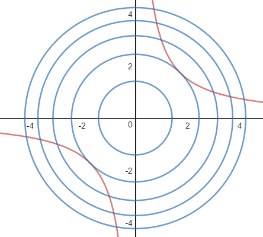
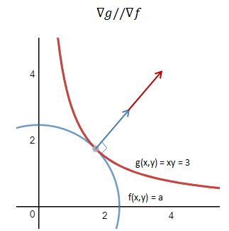
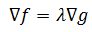

===================================
优化算法
===================================

总
https://www.cnblogs.com/maybe2030/p/4751804.html

牛顿迭代法

https://www.cnblogs.com/bigmonkey/p/7593138.html

最小二乘法-线性回归
https://www.cnblogs.com/bigmonkey/p/8305145.html

http://www.cnblogs.com/maybe2030/p/4946256.html
1.7 拉格朗日乘数法
--------------------------------

作为一种优化算法，拉格朗日乘子法主要用于解决约束优化问题，基本的拉格朗日乘子法(又称为拉格朗日乘数法)，就是求函数 f(x1,x2,...) 在 g(x1,x2,...)=C 的约束条件下的极值的方法。其主要思想是引入一个新的参数 λ （即拉格朗日乘子），将约束条件函数与原函数联系到一起，使能配成与变量数量相等的等式方程，从而求出得到原函数极值的各个变量的解。拉格朗日乘子是数学分析中同一名词的推广。

示例：求双曲线函数 xy=3 上距离原点最近的点的坐标。

设(x,y) 是函数上的任意一点，则距离原点的距离为：

.. math::

  f(x,y) =  \sqrt{(x^2 + y^2)}

 求距离最近的点即求 f(x,y) 的最小值，我们用其平方来替代。

 .. math::

  f(x,y) =  \(x^2 + y^2)

 同时需要满足的限制条件是：

 .. math::

  g(x,y) =  xy = 3

  用等高线来可视化这个问题：

明显，两个函数的曲线相切的点就是我们要求的点。如果把双曲线看作自身的等高线，那么两个等高线相切时，二者在切点处的切线也相同，也就是说它们的梯度向量平行，即：

如果两个向量平行，则其中一个梯度向量可以写为另一个的常数倍：

这样，我们把问题转化为了一个含有3个未知变量的方程组：

.. image:: images/拉格朗日乘数4.png

到这里，已经可以用最简单的代入法求解了。这个方程组就称为拉格朗日方程组。λ就是拉格朗日乘子。

拉格朗日乘数法并不会告诉我们最值的类型，结果可能是最大值、最小值或鞍点，那么如何判断是最大值还是最小值呢？只能通过将拉格朗日方程组的解代入问题方程来判断。