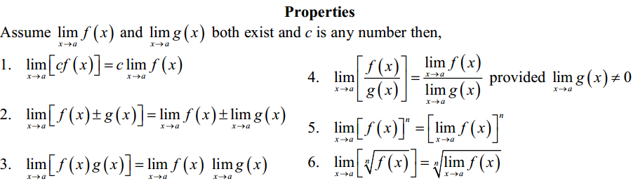
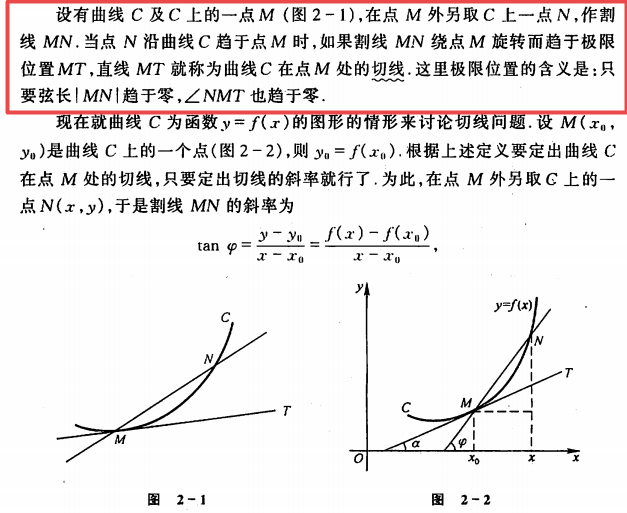
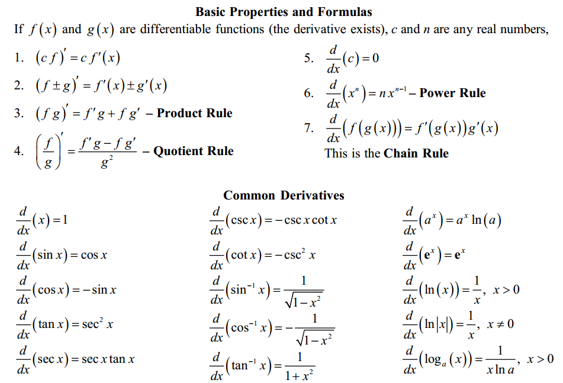
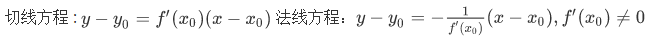
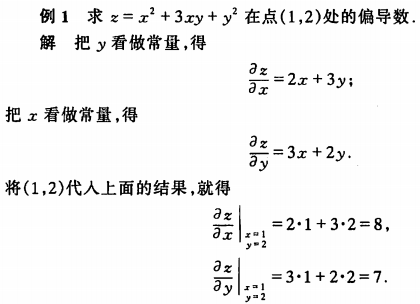
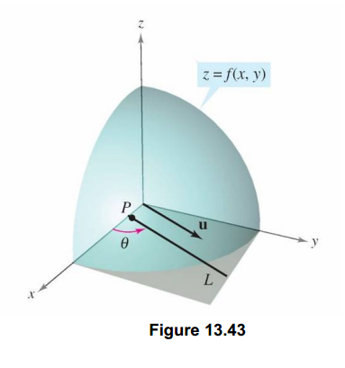
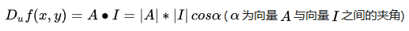
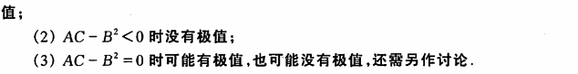

===================================
微积分 Calculus
===================================

.. contents:: :local:

.. 资料： D:\书\整理后\Data Science\高等数学和微积分\同济大学教材+cheatsheet 2本
.. 有道笔记 

1. 微积分简介 TODO
===================================
微积分最关键的概念，是帮助理解函数是如何随着时间而变化的（导数），以及如何计算一定时间内累计的总量（积分）。微积分帮助我们能用精确的语言来描述函数的这种性质。

**微积分与机器学习的联系**

机器学习中很多优化算法会用到导数的概念。例如，梯度下降中会使用导数来决定是增加还是减小权重来使得目标函数到达极值。

2. 函数与极限 
===================================

2.1 映射与函数
--------------------

**映射**
两个非空的集合A和B，如果存在一套法则f，使得A中的每个元素按照该法则都有Y中的唯一元素与其对应，则称f是A到B的映射。映射又称为算子。如果A、B是实数集（或其子集），则这个映射通常也称为函数。

**函数**
函数描述了一组输入与输出之间的映射关系，对于每个输入，总有唯一的确定的输出与之对应。输入也称为自变量，输出称为因变量；自变量的有效取值范围记为定义域，因变量的全体元素构成的集合称为值域。

2.2 极限的定义 
---------------------------

.. image:: images/函数极限定义.png

通俗的讲，当自变量 x 的值无限接近于某个确定的数 a 的过程中（无论从 a 的左侧还是右侧接近），如果对应的函数值 f(x) 无限接近于某个确定的数值L，那么就说 L 是函数 f(x) 在 x 无限趋近于 a 时的极限。这个 a 可以是一个有限值，也可以是正负无穷大。

2.3 左极限与右极限
----------------------------------------
和函数极限的定义相同，唯一区别是左极限只考虑 x 从左侧趋近于 a，右极限只考虑 x 从右侧趋近于 a。如果函数在某处存在极限，则其充分必要条件是函数在该处的左极限与右极限各自存在且相等。

2.4 极限的运算法则
----------------------------------------
一些基本的函数极限运算法则。更详细具体的运算和求极限技巧可以参考任何一本高等数学或微积分教材。

.. image:: images/极限运算性质2.png

2.5 在正负无穷大处的极限
----------------------------------------

.. image:: images/无穷大处的极限.png

2.6 函数的连续性与间断点
--------------------------

2.6.1 函数的连续性
^^^^^^^^^^^^^^^^^^^^^^

设函数 f(x) 在点 x0 的某一个邻域内有定义，如果 x 趋近于 x0 时，f(x)的值趋近于 f(x0)，则称函数 f(x) 在点x0连续。或者说，当x的增量趋于0时，函数y对于的增量也趋于0，则函数在该点连续。在区间内的每一点都连续的函数，叫做该区间上的连续函数。

从几何意义理解，连续函数的图像是一条连续不间断的曲线。

基本初等函数在其定义域内都是连续的。包括：三角函数、指数函数、幂函数、对数函数等。

2.6.2 函数的间断点
^^^^^^^^^^^^^^^^^^^^^^^^

符合下列3种情形之一：
 - 在 x=x0 处没有定义
 - 有定义，但极限不存在
 - 有定义，极限存在，但该点极限值不等于该点的函数值

则函数在该点不连续，该点称为间断点。

2.6.3 介值定理
^^^^^^^^^^^^^^^^^^^^^^^^

.. image:: images/介值定理.png

通俗的讲，设函数 f(x) 在闭区间 [a,b] 上连续，且在该区间的端点各自取值 f(a)=A, f(b)=B, 那么对于 A 和 B 之间的任意一个数 M，在开区间 (a,b) 内至少有一个点 c 使得 f(c)=M 。

3. 导数 
===================================

3.1 如何理解导数
-----------------------

导数的产生与直线运动的瞬时速度（物理学）和切线问题（几何学）紧密相关。下面我们从几何学的角度探讨下导数的由来。
 

**几何学的定义**

几何学中，斜率（slope）代表的是一条线段的陡峭程度，即给定一个特定的 x 方向上的变动，y 会如何改变？

.. image:: images/lope_formula.png

基于上述定义，我们可以很容易的计算两点之间的斜率，但如果我们想知道曲线上某个特定点处（切线）的斜率呢？导数就能帮助我们解答这个问题。

在深入例子之前，我们先来明确一下切线的定义。圆的切线指的是与曲线只有一个交点的直线，但对于广义上曲线，这个定义并不精确，因为与一条曲线只有一个交点的直线可能有两条（考虑x轴和y轴相对于二次函数抛物线）。因此，更精确的定义如下：

下面我们来看如何求曲线上某特定点处切线的斜率。考虑下图  :math:`f(x) = x^2 + 3` 的函数图像：

.. image:: images/slope_intro.png

点 (1,4) 和点 (3,12) 之间的斜率计算很简单：

.. math::

  slope = \frac{y2-y1}{x2-x1} = \frac{12-4}{3-1} = 4

那么，如何计算特定点 (1,4) 处（切线）的斜率呢？自然我们会想到找到该点左右两边最近的两个点，计算这两点之间的斜率。导数的产生正来源于此，只不过我们可以用极限来替代找到两个点的过程。要求得已知曲线 f(x) 上某个特定点处切线的斜率，我们不妨在该曲线上任意位置（方便起见，假设在该点右侧好了）再取一个点，比如 (3,12)，当该点沿着曲线 f(x) 无限趋近于点 (1,4) 时，此时如果上式

.. math::

  slope = \frac{y2-y1}{x2-x1} 

的极限存在，则此极限就是该点处切线的斜率。

3.2 计算某点处切线的导数
--------------------------
我们来自己动手计算一下。计算某点切线的斜率和计算两点之间的斜率一样，只不过现在计算的是给定点和与它无限接近的另一个点之间的斜率。我们用 h 来表示这个无穷小的距离。

1. 给定函数

.. math::

  f(x) = x^2

2. 对 :math:`x` 增加一个无穷小的量 :math:`h (h = Δx)`

.. math::

  f(x + h) = (x + h)^2

3. 套用斜率计算公式

.. math::

  \frac{f(x + h) - f(x)}{h}

4. 化简

.. math::

  \frac{x^2 + 2xh + h^2 - x^2}{h} \\

  \frac{2xh+h^2}{h} = 2x+h

5. 将 :math:`h` 设为 0 (因为 :math:`h` 的极限是 0)

.. math::

  {2x + 0} = {2x}

所以我们看到，对于二次函数 :math:`f(x) = x^2`, 在曲线上任何位置的斜率都等于 :math:`2x`. 

3.3 导数的定义
--------------------------

从上节的例子中，我们总结下在特定点处切线的斜率计算公式（即如下极限）

.. math::

  \lim_{h\to0}\frac{f(x+h) - f(x)}{h}

由此，可以得到函数的导数概念：

设函数 :math:`y=f(x)`  在点 :math:`x_0` 的某个邻域内有定义，当自变量 :math:`x` 在 :math:`x_0` 处取得增量 :math:`h` (点 :math:`x+h` 仍在该邻域内)时，相应的函数取得增量 :math:`f(x_0+h)-f(x_0)` ；如果这两者之比（即上述斜率计算公式）在 :math:`h` 无限趋近于 0 时的极限存在，则称函数 :math:`y=f(x)`  在点 :math:`x_0` 处可导，并称这个极限为函数 :math:`y=f(x)`  在 :math:`x_0` 处的导数，记为 :math:`y=f'(x_0)`。

对于函数  :math:`y=f(x)`, 如果它在某开区间内每点都可导，则称函数在开区间内可导，这样对于该区间内任意一个  :math:`x` 都对应了一个确定的导数值，这样就构成了一个新的函数，称为原函数  :math:`y=f(x)` 的导函数  :math:`y=f'(x)`。导函数也有其他几个等同的写法，如下。

.. image:: images/导函数定义.png

从上述的例子我们可以看出，导数可以理解为曲线上某一点处切线的斜率。如果我们把曲线函数看成时间-路程的函数，那么某点处的导数也可以理解为该时间点处的瞬时速度；更广义一些，也可以看成该点处的瞬时变化率。

.. image:: images/理解导数.png

3.4 求导法则与导数公式
-------------------------------

求导的几个基本法则，和几个基本初等函数的导数公式。

3.5 复合函数的求导法则: 链式法则 Chain Rule
--------------------------------------------------------------

对于两个函数组合起来的复合函数，其导数等于里层函数值代入外层函数的导数，乘以里层函数的导数。

更正式的定义： 如果 u=g(x) 在 x 处可导，而 y=f(u) 在点 u=g(x) 处可导，则复合函数 y=f[g(x)] 在点 x 处可导，其导数为
f'(g(x))*g'(x)

假设我们有一个复合函数如下：

.. math::

  f(x) = A(B(C(x)))

.. math::

  \begin{align}
  A(x) & = sin(x) \\
  B(x) & = x^2 \\
  C(x) & = 4x
  \end{align}

它们各自对于的导数是：

.. math::

  \begin{align}
  A'(x) &= cos(x) \\
  B'(x) &= 2x \\
  C'(x) &= 4
  \end{align}

计算该复合函数的导数：

.. math::

  f'(x) = A'( (4x)^2) \cdot B'(4x) \cdot C'(x)

.. math::

  \begin{align}
  f'(x) &= cos((4x)^2) \cdot 2(4x) \cdot 4 \\
        &= cos(16x^2) \cdot 8x \cdot 4 \\
        &= cos(16x^2)32x
  \end{align}

下图是链式法则在特定函数上的应用：

.. image:: images/链式法则.png

3.6 高阶导数
-------------------------------

f'(x) 是函数 f(x) 的一阶导数，对它再求导，即导数的导数叫做对 f(x) 的二阶导数，记作 f''(x)，相应的还可以有更高阶的导数。高阶导数的写法如下图：

.. image:: images/高阶导数.png

3.7 平面曲线的切线与法线
-------------------------------

过曲线上某点(x0,y0) 的切线和法线方程可以写为：

3.8 几个重要的中值定理
--------------------------------------------------------------

3.7.1 罗尔定理
^^^^^^^^^^^^^^^^^^^^^^^^
定理内容：如果 R 上的函数 f(x) 满足以下条件：
（1）在闭区间 [a,b] 上连续
（2）在开区间 (a,b) 内可导
（3）f(a)=f(b)
则至少存在一个 ξ∈(a,b)，使得 f'(ξ)=0

.. image:: images/罗尔定理.jpg

几何意义：若连续曲线 y=f(x) 在区间 [a,b] 上所对应的弧段 AB，除端点外处处具有不垂直于 x 轴的切线，且在弧的两个端点 A,B 处的纵坐标相等，则在弧 AB 上至少有一点 C，使曲线在C点处的切线平行于 x 轴。

3.7.2 拉格朗日中值定理
^^^^^^^^^^^^^^^^^^^^^^^^

拉格朗日中值定理是罗尔中值定理的推广，它反映了可导函数在闭区间上的整体的平均变化率与区间内某点的局部变化率的关系。

定理内容：如果函数 f(x) 满足：
（1）在闭区间 [a,b] 上连续
（2）在开区间 (a,b) 上可导
那么在 (a,b) 内至少有一点 ξ，使得 f(b)-f(a) = f'(ξ)(b-a)

.. image:: images/拉格朗日中值定理.png

几何意义：若连续曲线 y=f(x) 的弧 AB 上除了端点外处处具有不垂直于x轴的切线，那么曲线上至少有一点 C，使得曲线在 C 处的切线平行于弦 AB。

物理意义：对于直线运动，在任意一个运动过程中至少存在一个位置（或一个时刻）的瞬时速度等于这个过程中的平均速度。

3.7.3 柯西中值定理
^^^^^^^^^^^^^^^^^^^^^^^^

定理内容：如果函数 f(x) 及 F(x) 满足：

（1）在闭区间 [a,b] 上连续
（2）在开区间 (a,b) 上可导
（3）对任一 x 属于 (a,b)，F'(x)不等于0

那么在 (a,b) 内至少有一点 ξ，使等式

.. math::

  \frac{f(b) - f(a)}{F(b) - F(a)} = \frac{f'(ξ)}{F'(ξ)}

成立。

3.7.3 泰勒中值定理 TODO
^^^^^^^^^^^^^^^^^^^^^^^^

3.8 函数的微分
-----------------
3.8.1 微分的定义
^^^^^^^^^^^^^^^^^^^^^^^

微分和导数的概念紧密相关。

导数是指函数在某点处的**瞬时变化率**（或者说该点切线的斜率），即 y 的增量与 x 的增量的比值的极限。

微分是指函数在某点处的**变化量**，其定义是，如果函数在某点处的增量 △y 可以分解为 A△x 与 o(△x) 两部分的和（o(△x) 是关于△x的高阶无穷小），则前者（线性主部）称为在该点相对于自变量增量 △x 的微分，记为 dy，当 △x 非常小时，△y 的值可以由这个微分来近似替代，而忽略 o(△x) 部分。这个 A 就等于该点处的导数 f'(x)。在f'(x)!=0的条件下，我们可以用微分 dy = f'(x)dx 来替代真正的增量 △y。

从几何意义来看，导数的值是曲线该点处切线的斜率，而微分的值 dy 是沿着切线方向向上纵坐标的增量，△y 的值是沿着曲线方向上纵坐标的增量，当 △x 非常小时，就可以用切线上的增量代替曲线上的增量,在数学上也称为非线性函数的局部线性化（在局部用切线段近似替代曲线段）。

.. image:: images/微分几何意义1.png
.. image:: images/微分几何意义2.png

对一元函数而言, 可导必可微, 可微必可导。

4. 导数的应用
===================================

4.1 函数的驻点
----------------

如果满足: f'(c)=0 ,则称 x=c 是函数 f(x) 的驻点。
 
（有些教材也将不可导的点归为驻点）

在驻点处，函数的一阶导数为0，此处的切线平行于 x 轴。

4.2 函数单调性的判定方法
--------------------------------
设函数 f(x) 在区间 I 上连续且可导：

 - 如果在区间 I 内 f'(x)>0，则该区间内函数是单调增加的
 - 如果在区间 I 内 f'(x)<0，则该区间内函数是单调减少的
 - 如果在区间 I 内 f'(x)=0，则该区间内函数是个常数

4.3 曲线的凹凸性
-----------------------------------

- （向上）凸的曲线：在曲线上任取两点，连接这两点的弦总是位于曲线的下方（下图的曲线 ACB）
- （向上）凹的曲线：在曲线上任取两点，连接这两点的弦总是位于曲线的上方（下图的曲线 ADB）

.. image:: images/曲线凹凸.png

4.4 凹凸性的判定方法
--------------------------------
设函数 f(x) 在区间 I 上连续且具有一阶和二阶导数：

 - 如果在区间 I 内 f''(x)>0，则该区间内函数是向上凹的
 - 如果在区间 I 内 f''(x)<0，则该区间内函数是向上凸的

如何理解：以二次函数  :math:`f(x) = x^2` 为例，其一阶导数等于 2x，其涵义即函数任何一点上的切线斜率，在 y轴右侧 2x的值恒 >0，因此该函数在 y轴右侧的区间内是单调增加的，同理在 y轴左侧是单调递减的；其二阶导数等于2，其涵义即函数任何一点上的切线斜率的变化率，在整个函数定义域内二阶导数恒 >0，因此每一点处的切线斜率会越来越大，函数图像向上凹。

4.5 曲线的拐点
--------------------------------
如果在 x=c 处函数的凹凸性改变了，那么该点也称为函数曲线的拐点。寻找拐点的方法很简单，先求出令 f''(x)=0 的点或二阶导数不存在的点，观察这些点的左右两侧二阶导数的符号，如果两边符号相反，则该点是拐点。

4.6 函数极值、最大值与最小值
--------------------------------
函数极值的概念：

.. image:: images/函数极值.png

4.6.1 费马引理（Fermat's Theorem）
^^^^^^^^^^^^^^^^^^^^^^^^^^^^^^^^^^^^^

函数的每一个极值都是驻点，函数的导数在该点为零，或者是不可导的点。

4.6.2 如何寻找函数极值点
^^^^^^^^^^^^^^^^^^^^^^^^^^^^^^^^^^^^^

基于费马引理，我们可以通过求驻点（或不可导点）来找到函数极值点，再结合二阶导数来区分是极大还是极小值。步骤如下：

 1. 求导数 f'(x)
 2. 求函数的所有驻点（f'(x)=0 的点）和不可导点
 3. 观察 f'(x) 的符号在每个驻点和不可导点的左右邻近的情形，确定是否是极值点

如果 f(x) 在 x0 处具有二阶导数且 f'(x0)=0, f''(x0)!=0，则：
 1. 当 f''(x0)<0 时，函数在该点取得极大值（因为函数在该段区间是向上凸的）
 2. 当 f''(x0)>0 时，函数在该点取得极小值（因为函数在该段区间是向上凹的）

5. 多元函数
================

5.1 偏导数
--------------------------------
**定义**

以二元函数 z = f(x,y) 为例，如果将 y 看为固定，这时它就是 x 的一元函数，函数对 x 的导数就称为该二元函数 z 对 x 的偏导数。推广开来，一个多变量的函数的偏导数，就是它关于其中一个变量的导数而保持其他变量恒定。

如果多元函数 z 在定义域内每一点处对 x 的偏导数都存在，那这个偏导数就称为对自变量 x 的偏导函数。

需要注意的是，多元函数的偏导数存在只能保证某点 P 沿着平行于坐标轴的方向趋近于 P0 时，函数值 f(P) 趋于 f(P0)，但不能保证 P 按任何方式趋近于 P0 时函数值都趋于 f(P0)。换句话说，偏导数只反映了函数沿着坐标轴正方向上的变化率，而不是任意方向。

**计算方法**

与计算一元函数的偏导数方法相同，只要把其他变量暂时看作常量即可。例子：

**高阶偏导数**

.. image:: images/高阶偏导数.png

高阶混合偏导数在偏导数连续的条件下，值与求导的顺序无关。

5.2 方向导数
--------------------------------
前面提到了，函数的偏导数是函数沿着坐标轴正方向上的变化率，但如果我们要求函数在任意方向上的变化率该肿么办？这时就引入了方向导数的概念。

假设 z = f(x,y) 在 xyz 坐标系中是这样一个曲面，点 P(x0,y0) 是定义域中的一个点。我们已经知道通过求偏导数能知道该点 P 关于x轴和y轴的切线斜率，现在要求该点沿着单位向量 u =cosθ + sinθ （θ是该单位向量与x轴的正向夹角）方向的变化率（即P沿着射线L方向的变化率），类比一元函数导数的定义，如果下列极限存在：

.. image:: images/方向导数公式.png

则这个极限是函数f沿着u方向的方向导数。随着θ的变化，可以求出任意方向的方向导数。因此，方向导数反映的是多元函数在 P0 点沿着任意方向 u 的变化率，即函数的增量与 P 到 L 上另一点 P0 的距离的比值的极限。

在求上述极限时，除了用极限定义外，还可以用偏微分方法简化计算，直接得到方向导数公式：

.. image:: images/方向导数公式2.png

方向导数公式的具体证明可以参考参考资料中同济大学高等数学教材 P102页。

5.3 梯度
--------------------------------
在说明方向导数的时候，我们得到了方向导数公式：

.. image:: images/方向导数公式2.png

设：

.. image:: images/梯度1.png

则这个方向导数的数量积为：

如果要让方向导数取得最大值，则夹角要为0度，即向量 I（即变化率最快的方向）与向量 A（当点P(x,y)确定时，该向量也确定）平行的时候，两者的数量积最大，函数 f(x) 的增长最快。A 即是梯度向量。换句话说，函数某点处的梯度就是函数对各个自变量的偏导数依次排序形成的向量。

同样的，当向量I与向量A的夹角为180度时，函数 f(x) 减少的最快，函数沿着这个方向的方向导数达到最小值。

最后，总结一下上面三节的关键概念:

- 方向导数：是一个数；反映的是f(x,y)在P0点沿方向u的变化率。
- 偏导数：是多个数（每元有一个）,是指多元函数沿坐标轴方向的方向导数，因此二元函数就有两个偏导数。
- 偏导函数：是一个函数,是一个关于点的偏导数的函数。
- 梯度：是一个向量,每个元素为函数对一元变量的偏导数,它既有大小（其大小为最大方向导数），也有方向。

5.4 多元函数的极值
----------------------
与一元函数的情况一样，机器学习中我们经常会遇到多元函数求极值的问题。极大值和极小值统称为极值。下面我们看如何求极值。

5.4.1 极值的必要条件
^^^^^^^^^^^^^^^^^^^^^^^^^^
回忆一元函数求极值，如果 x 是极值点，且f'(x) 存在，则f'(x)必为0（或不可导点），但反过来导数为0的点不一定是极值点，此为一元函数极值的必要条件。

多元函数极值的必要条件也类似，以二元函数为例，设 z=f(x,y) 在某点取得极值，则该点处的梯度必为零向量，既每个偏导数都为零。

另外，定义梯度为零向量的点为多元函数的驻点。具有偏导数的多元函数的极值点必定是驻点，但驻点不一定是极值点。非极值点的驻点称为鞍点。

5.4.2 极值的充分条件
^^^^^^^^^^^^^^^^^^^^^^^^^^^
回忆一元函数求极值的过程：
如果 f(x) 在 x0 处具有二阶导数且 f'(x0)=0, f''(x0)!=0，则：
 1. 当 f''(x0)<0 时，函数在该点取得极大值（因为函数在该段区间是向上凸的）
 2. 当 f''(x0)>0 时，函数在该点取得极小值（因为函数在该段区间是向上凹的）

类似的，二元函数求极值过程如下：

.. image:: images/多元函数极值1.png
 

.. rubric:: References
.. [1] Calculus Cheat Sheet http://tutorial.math.lamar.edu/pdf/Calculus_Cheat_Sheet_All.pdf
.. [2] 《高等数学（第六版）》同济大学数学系 编，高等教育出版社

..  https://blog.csdn.net/jshazhang/article/details/81805873 HESSIAN矩阵

.. https://blog.csdn.net/acdreamers/article/details/41413787 HESSIAN矩阵
.. https://zhuanlan.zhihu.com/p/35323714 Jacobian、Hessian、Laplacian 