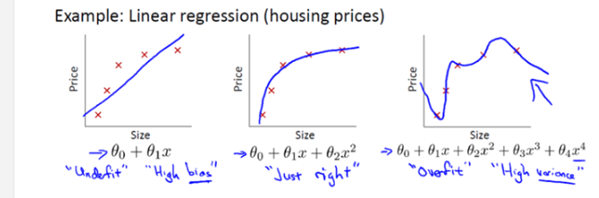
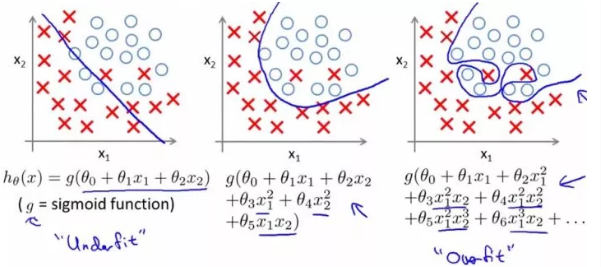
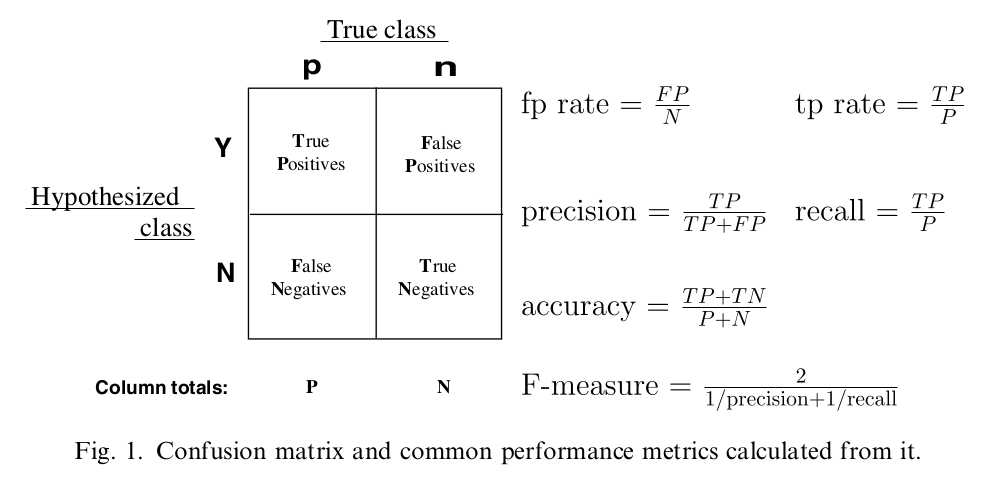
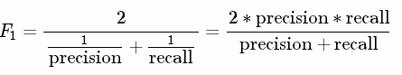
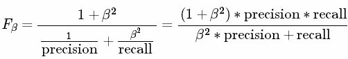
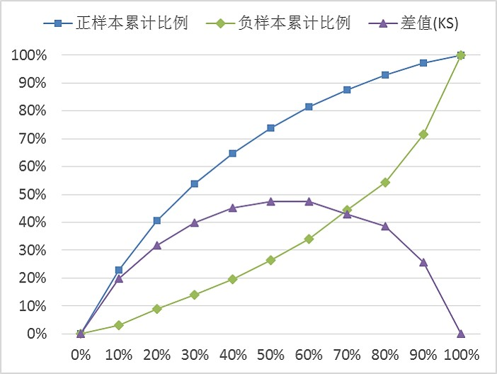
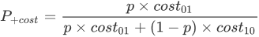
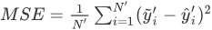
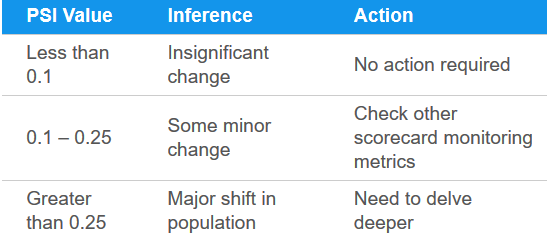

[TOC]

模型评估与调优
===================================

# 1. 泛化能力

泛化能力指的是训练得到的模型**对未知数据的预测能力**。我们建模的目的是让模型不仅对已知数据，而且对未知数据都能有较好的预测能力。对模型预测能力的评估，可以通过样本上的训练误差和测试误差来估计。这里有三个概念：

- 损失函数：度量预测错误程度的函数

- 训练误差：训练数据集上的平均损失，虽然有意义，但本质不重要
- 测试误差：测试数据集上的平均损失，反应了模型对未知数据的预测能力

我们通常利用**最小化训练误差**的原则来**训练模型**，但真正值得关心的是测试误差。一般情况下我们通过测试误差来近似估计模型的泛化能力。对于一个好的模型，其训练误差约等于泛化误差。

# 2. 过拟合与欠拟合

## 2.1 基本概念

当机器学习模型对训练集学习的太好的时候，此时表现为训练误差很小，而泛化误差会很大，这种情况我们称之为**过拟合**，而当模型在数据集上学习的不够好的时候，此时训练误差较大，这种情况我们称之为**欠拟合**。具体表现如下图所示（来源Coursera的机器学习课程），第一幅图就是欠拟合，第三幅图就是过拟合。

### 2.1.1 欠拟合的产生

欠拟合产生的原因主要有两个：

**模型过于简单** 即模型形式太简单，以致于无法捕捉到数据特征，无法很好的拟合数据，如下图。在模型后加入一个二次项，拟合能力就提升了许多。

**缺乏强预测能力的特征** 很容易懂，可以通过组合、泛化等各种手段增加特征。

### 2.1.2 过拟合的产生

过拟合产生的原因主要有三个：

**模型记住了数据中的噪音** 意味着模型受到噪音的干扰，导致拟合的函数形状与实际总体的数据分布相差甚远。这里的噪音可以是标记错误的样本，也可以是少量明显偏离总体分布的样本（异常点）。通过清洗样本或异常值处理可以帮助缓解这个问题。

**训练数据过少** 导致训练的数据集根本无法代表整体的数据情况，做什么也是徒劳的。需要想方设法增加数据，包括人工合成假样本。

**模型复杂度过高** 导致模型对训练数据学习过度，记住了过于细节的特征，如下图（来源Coursera的机器学习课程）。

## 2.2 模型容量

通俗的讲，模型的容量是指模型拟合各种函数的能力。例如，模型是三次多项式构成的函数：

能拟合的函数包括一次函数、二次函数和三次函数。但它不能拟合更高阶的函数。另外，它输出的是参数的线性函数，无法描述非线性关系。

- 容量低的模型容易发生欠拟合，模型拟合能力太弱。
- 容量高的模型容易发生过拟合，模型拟合能力太强。

通过选择不同的假设空间可以改变模型的容量。模型的假设空间指的是：代表模型的函数集合，也称作模型的表示容量`representational capacity`。例如，线性回归算法将关于其输入的所有线性函数作为假设空间。由于额外的限制因素（比如优化算法的不完善），模型的有效容量`effective capacity`一般会小于模型的表示容量。通常在模型的假设空间中出最佳的函数是非常困难的优化问题，实际应用中只是挑选一个使得训练误差足够低的函数即可。

统计学习理论提供了量化模型容量的方法，其中最出名的是 VC 维理论：**训练误差与泛化误差之间差异的上界随着模型容量增长而增长，随着训练样本增多而下降** 。

虽然`VC` 维理论对于机器学习算法有很好的指导作用，但是它在深度学习很难应用。原因有二：

- 边界太宽泛。
- 难以确定深度学习的容量。由于深度学习模型的有效容量受限于优化算法，因此确定深度学习模型的容量特别困难。

通常泛化误差是关于模型容量的 `U`形函数。随着模型容量增大：

- 训练误差会下降直到逼近其最小值。
- 泛化误差先减小后增大。
- 泛化误差与训练误差的差值会增大。

# 3. Bias-Variance

## 3.1 偏差和方差

**偏差：**the difference between your model's expected predictions and the true values. 衡量了模型期望输出与真实值之间的差别，刻画了模型本身的拟合能力。

**方差：**refers to your algorithm's sensitivity to specific sets of training data. High variance algorithms will produce drastically different models depending on the training set.  度量了训练集的变动所导致的学习性能的变化，刻画了模型输出结果由于训练集的不同造成的波动。

 

**高偏差，低方差**的算法在不同训练集上训练得到的模型基本一致，但预测值与真实值差距较大；**高方差，低偏差**的算法得到的模型的预测值和真实值差距小，但在不同训练集上得到的模型输出波动大。

**噪音：**度量了在当前任务上任何学习算法所能达到的期望泛化误差的下界，刻画了学习问题本身的难度。

## 3.2 误差分解

如上图，泛化误差可以分解为偏差、方差和噪声之和。

偏差-方差分解表明：泛化性能是由学习算法的能力、数据的充分性以及学习任务本身的难度共同决定的。

偏差、方差与模型容量有关。用`MSE`衡量泛化误差时，增加容量会增加方差、降低偏差。

- 偏差降低，是因为随着容量的增大，模型的拟合能力越强：对给定的训练数据，它拟合的越准确。
- 方差增加，是因为随着容量的增大，模型的随机性越强：对不同的训练集，它学得的模型可能差距较大。

一般来说，偏差和方差是由冲突的，这称作偏差-方差窘境`bias-variance dilemma`。

给定学习任务：

- 在训练不足时模型的拟合能力不够强，训练数据的扰动不足以使模型产生显著变化，此时偏差主导了泛化误差。
- 随着训练程度的加深，模型的拟合能力逐渐增强，训练数据发生的扰动逐渐被模型学习到，方差逐渐主导了泛化误差。
- 在训练充分后模型的拟合能力非常强，训练数据发生的轻微扰动都会导致模型发生显著变化。
- 若训练数据自身的、非全局的特性被模型学到了，则将发生过拟合。

## 3.3 误差诊断

偏差-方差可以反映模型的过拟合与欠拟合。

- **高偏差对应于模型的欠拟合**：模型过于简单，以至于未能很好的学习训练集，从而使得训练误差过高。例如，用 linear regression 去拟合非线性的数据集。此时模型预测的方差较小，表示预测较稳定。但是模型预测的偏差会较大，表示预测不准确。

- **高方差对应于模型的过拟合**：模型过于复杂，以至于将训练集的细节都学到，将训练集的一些细节当做普遍的规律，从而使得测试集误差与训练集误差相距甚远。例如，不做任何剪枝的决策树，可以在任何训练集上做到极高的准确率。此时模型预测的偏差较小，表示预测较准确。但是模型预测的方差较大，表示预测较不稳定。

通过训练误差和测试误差来分析模型是否存在高方差、高偏差。

- 如果训练误差较高：说明模型的方差较大，模型出现了欠拟合。
- 如果训练误差较低，而训练误差较高：说明模型的偏差较大，出现了过拟合。
- 如果训练误差较低，测试误差也较低：说明模型的方差和偏差都适中，是一个比较理想的模型。
- 如果训练误差较高，且测试误差更高：说明模型的方差和偏差都较大。

上述分析的前提是：训练集、测试集的数据来自于同一个分布，且噪音较小。

## 3.4 误差缓解

过拟合和欠拟合的解决方法很多，并且针对不同算法有不同的方法。有时间系统的梳理一遍，这里只是简单罗列一些方法。

|          | 过拟合                                                       | 欠拟合                                                       |
| -------- | ------------------------------------------------------------ | ------------------------------------------------------------ |
| 表现     | 对已知数据预测的很好，但对未知数据预测很差（训练误差和测试误差的差距较大） | 对已知数据预测就很差（训练误差较大）                         |
| 产生原因 | 1.模型记住了数据中的噪音   2.训练数据过少   3.模型复杂度过高 | 1.模型过于简单  2.缺乏强预测能力的特征                  |
| 解决方法 | 1.去除噪音/清洗样本  2.增加数据  3.正则化   4.降低模型复杂度  5.DropOut/Early Stopping  6.集成学习   7. 剪枝 | 1.选择模型容量更高的模型  2.通过各类特征工程方法增加可用特征 |

如果模型存在高偏差（欠拟合），则通过以下策略可以缓解：

- 选择一个容量更大、更复杂的模型。
- 增加更多有预测能力的强特征。

如果模型存在高方差（过拟合），则通过以下策略可以缓解：

- 数据清洗，避免由于噪音数据导致的模型问题。
- 增加更多的训练数据。它通过更多的训练样本来对模型参数增加约束，会降低模型容量。
- 使用正则化。在模型的优化目标里加入正则化项来对模型参数增加约束，以此降低模型复杂度。
- 神经网络中，可以增加 Dropout层，即让一部分的神经元以一定概率不工作。
- 神经网络中，还可以通过 Early Stopping 避免过拟合。在神经网络的训练过程中我们会初始化权值参数，此时模型的拟合能力较弱，通过迭代训练来提高模型的拟合能力。当验证集上的误差没有进一步改善时，算法提前终止。
- 集成学习，利用多个学习器组合在一起做出决策，弱化每个单独模型的特性。
- 对于决策树算法，剪枝是有效的防止过拟合手段。预剪枝通过在训练过程中控制树深、叶子节点数、叶子节点中样本的个数等来控制树的复杂度。后剪枝则是在训练好树模型之后，采用交叉验证的方式进行剪枝以找到最优的树模型。

# 4. 模型评价指标

前文提到了，衡量模型泛化能力可以通过在测试集上的测试误差来估计，而模型的评价指标就是如何将多个模型上的误差转变为可比较的一套方法。不同的评价指标对应了不同的误差计算方法，可能会导致不同的比较结论，因此需要结合业务场景选择一个最有意义的指标体系。

## 4.1 分类问题

### 4.1.1 混淆矩阵、精确率与召回率

**混淆矩阵**

混淆矩阵是分类任务中较常见的评价指标。对于二分类问题，通常将关注的类作为正类（比如欺诈交易），其他类作为负类（比如正常交易）。令：

- TP: TRUE POSITIVE 分类器将正类预测为正类的数量
- FN: FALSE NEGATIVE 分类器将正类预测为负类的数量
- FP: FALSE POSITIVE 分类器将负类预测为正类的数量
- TN: TRUE NEGATIVE 分类器将负类预测为负类的数量

基于此，我们可以定义以下指标：

**准确率**：Accuracy = (TP+TN)/(P+N) ，预测正确的样本（TP和TN）在所有样本中占的比例。

在各类样本不均衡时，准确率不能很好表示模型性能，因为会出现大类 dominating 的情况，即大类准确率高，而少数类准确率低。这样情况下，需要对每一类样本单独观察。

**错误率**：Error Rate =  (FP+FN)/(P+N) ，即被预测错误的样本在所有样本中所占比例。

**精确率**（查准率）： Precision = TP/(TP+FP)，即所有被预测为正例的样本中，多少比例是真的正例。
**召回率**（查全率）： Recall = TP/(TP+FN)，即所有真的正例中，多少比例被模型预测出来了。

不同的问题中，有的侧重精确率，有的侧重召回率。
- 对于推荐系统，更侧重于精确率。即推荐的结果中，用户真正感兴趣的比例。因为给用户展示的窗口有限，必须尽可能的给用户展示他真实感兴趣的结果。
- 对于医学诊断系统，更侧重与召回率。即疾病被发现的比例。因为疾病如果被漏诊，则很可能导致病情恶化。

精确率和召回率是一对矛盾的度量。一般来说精确率高时召回率往往偏低，而召回率高时精确率往往偏低。
- 如果希望将所有的正例都找出来（查全率高），最简单的就是将所有的样本都视为正类，此时有`FN=0`。此时查准率就偏低（准确性降低）。
- 如果希望查准率高，则可以只挑选有把握的正例。最简单的就是挑选最有把握的那一个样本。此时有`FP=0`。此时查全率就偏低（只挑出了一个正例）。

**F1 Score**：精确率和召回率的调和平均。F1认为两者同等重要。

**F-beta Score**：F1 更一般的形式。

其中 Beta 度量了查全率对查准率的相对重要性。Beta大于1时，召回率更重要，在0-1之间时，精确率更重要。常用的Beta值有 2 和 0.5。

### 4.1.2 P-R 曲线

对二类分类问题，可以根据分类器的预测结果对样本进行排序：排在最前面的是分类器认为“最可能”是正类的样本，排在最后面的是分类器认为“最不可能”是正类的样本。

假设排序后的样本集合为 (x1,y1),(x2,y2)...,(xn,yn)  ，预测为正类的概率依次为 (p1,p2,...pn)  。接下来，从高到低依次将 pi 作为分类阈值，即大于该阈值判断为正例，小于该阈值判断为负例：

此时计算得到的精确率记做 Pi ，召回率记做 Ri 。以精确率为纵轴、召回率为横轴作图，就得到 `P-R`曲线。该曲线由点各个分类阈值水平下的 Recall-Precision 坐标组成。

 

`P-R`曲线从左上角`(0,1)` 到右下角`(1,0)` 。

开始时第一个样本（最可能为正例的）预测为正例，其它样本都预测为负类。此时：
- 查准率很高，几乎为1。 
- 查全率很低，几乎为0，大量的正例没有找到。

结束时所有的样本都预测为正类。此时：
- 查全率很高，正例全部找到了，查全率为1。
- 查准率很低，大量的负类被预测为正类。

`P-R`曲线直观显示出分类器在样本总体上的查全率、查准率。因此可以通过两个分类器在同一个测试集上的`P-R` 曲线来比较它们的预测能力：

- 如果分类器`B`的`P-R`曲线被分类器`A`的曲线完全包住，则可断言：`A`的性能好于`B` 。
- 如果分类器`A`的`P-R`曲线与分类器`B`的曲线发生了交叉，则难以一般性的断言两者的优劣，只能在具体的查准率和查全率下进行比较。

  此时一个合理的判定依据是比较`P-R`曲线下面积大小，但这个值通常不容易计算。

  可以考察平衡点。平衡点`Break-Even Point:BEP`是`P-R`曲线上查准率等于查全率的点，可以判定：平衡点较远的`P-R`曲线较好。

### 4.1.3 ROC 曲线与AUC 值

定义真正例率(`True Positive Rate`) 为：TPR = TP/(TP+FN) ，即正例的召回率。

定义假正例率(`False Positive Rate`) 为：FPR = FP/(TN+FP)  ，它刻画了模型将负例错误预测为正类的概率。

对二类分类问题，如果模型支持**输出预测概率**，则可以根据分类器的预测结果 (预测属于正例的概率) 对样本进行排序：排在最前面的是分类器认为“最可能”是正类的样本，排在最后面的是分类器认为“最不可能”是正类的样本。

假设排序后的样本集合为 (x1,y1),(x2,y2)...,(xn,yn)  ，预测为正类的概率依次为 (p1,p2,...pn)  。接下来，从高到低依次将 pi 作为分类阈值，即：

当样本属于正例的概率大于等于 pi 时，我们认为它是正例，否则为负例，这样每次选择一个不同的阈值，计算得到的真正例率记做 TPRi ，假正例率记做 FPRi 。以真正例率为纵轴、假正例率为横轴作图，就得到`ROC`曲线。该曲线由点 {(TPR1,FPR1),(TPR2,FPR2)...(TPRn,FPRn)} 组成。易得，测试数据越多，能供选取的阈值越多，ROC 曲线就越平滑。

`ROC`曲线从左下角`(0,0)` 到右上角`(1,1)` 。

开始时第一个样本（最可能为正例的）预测为正例，其它样本都预测为负类。此时：
- 真正例率很低，几乎为0，因为大量的正例未预测到。
- 假正例率很低，几乎为0，因为此时预测为正类的样本很少，所以几乎没有错认的正例。

结束时所有的样本都预测为正类。此时：
- 真正例率很高，几乎为1，因为所有样本都预测为正类。
- 假正例率很高，几乎为1，因为所有的负样本都被错认为正类。

在`ROC`曲线中:

- 对角线对应于随机猜想模型。
- 点`(0,1)`对应于理想模型：没有预测错误，`FPR`恒等于0，`TPR`恒等于1。
- 通常`ROC`曲线越靠近点`(0,1)`越好。

可以通过两个分类器在同一个测试集上的`ROC` 曲线来比较它们的预测能力：

- 如果分类器`A`的`ROC`曲线被分类器`B`的曲线完全包住，则可断言：`B`的性能好于`A` 。

- 如果分类器`A`的`ROC`曲线与分类器`B`的曲线发生了交叉，则难以一般性的断言两者的优劣。

  此时一个合理的判定依据是比较`ROC`曲线下面积大小，这个面积称作`AUC:Area Under ROC Curve`。

`P-R`曲线和`ROC `曲线刻画的都是阈值的选择对于分类度量指标的影响。

通常一个分类器对样本预测的结果是一个概率结果，比如正类概率 0.7。但是样本是不是正类还需要与阈值比较。

这个阈值会影响了分类器的分类结果，比如：是阈值 0.5 还是阈值 0.9。

- 如果更重视查准率，则将阈值提升，比如为 0.9 。
- 如果更看重查全率，则将阈值下降，比如为 0.5 。

`P-R`曲线和`ROC`曲线上的每一个点都对应了一个阈值的选择，该点就是在该阈值下的`(查准率，查全率)` /`(真正例率，假正例率)` 。沿着横轴的方向对应着阈值的下降。

`AUC`被定义为`ROC`曲线下的面积，显然这个面积的数值不会大于1。又由于`ROC`曲线一般都处于 y=x 这条直线的上方，所以AUC的取值范围在0.5和1之间。使用AUC值作为评价标准是因为很多时候`ROC`曲线并不能清晰的说明哪个分类器的效果更好，而作为一个数值，对应AUC更大的分类器效果更好。

直观的理解，`AUC`值是一个概率值，涵义是当你随机挑选一个正样本以及一个负样本，当前的分类算法根据计算得到的预测值将这个正样本排在负样本前面的概率就是AUC值。AUC值越大，当前的分类算法越有可能将正样本排在负样本前面，即能够更好的分类。

`ROC`曲线有个很好的特性：**当测试集中的正负样本的分布变化的时候，ROC 曲线能够保持不变**，**而 P-R 曲线的形状则会发生较大变化**。在实际的数据集中经常会出现类不平衡现象，即负样本比正样本多很多（或者相反），而且测试数据中的正负样本的分布也可能随着时间变化，此时使用对样本分布不敏感的评价指标就显得十分重要。

另外，`ROC`曲线对于排序敏感，而对预测的具体分数则不怎么敏感。

### 4.1.4 K-S 曲线

常用的一种评价二元分类模型的方法，来源于 Kolmogorov-Smirnov Test。 KS值越大，说明模型能将两类样本区分开的能力越大。

KS 曲线的绘制很简单，先将实例按照模型输出值进行排序，通过改变不同的阈值得到小于（或大于）某个阈值时，对应实例集合中正（负）样本占全部正（负）样本的比例（即TPR 和 FPR，和 ROC 曲线使用的指标一样，只是两者的横坐标不同）。由小到大改变阈值从而得到多个点，将这些点连接后分别得到正、负实例累积曲线。正、负实例累积曲线相减得到KS曲线， KS曲线的最高点即KS值，该点所对应的阈值划分点即模型最佳划分能力的点。

在信贷风险评分场景中，KS值也是常见的一个评价指标，其绘制方式与上述稍有不同，其定义为各段信用评分组别中，好坏客户的累计占比曲线的最大差值，即横轴不再是模型的输出阈值，而是信用评分区间，一般把所有样本等分划为10等份，每一份计算该区间内的 KS。

一般，KS<0.3 表示模型的预测能力不佳，ks>0.3表示能力良好。

具体实践中，由于 KS 本身的限制（**即只关注一个组别为代表，而不能反映所有区间上的区分效果**），容易产生以偏概全的结论，因此在判断模型能力时，需要观察整条 KS 曲线在不同区间上的形状，或者搭配其他的评价指标共同权衡。KS值本身相对而言，更适合作为寻找最佳切分阈值的参考。

### 4.1.5 代价矩阵

实际应用过程中，不同类型的错误所造成的后果可能有所不同。如：将健康人诊断为患者，与将患者诊断为健康人，其代价就不同。为权衡不同类型错误所造成的不同损失，可以为错误赋予非均等代价（`unequal cost`）。

对于二类分类问题，可以设定一个“代价矩阵”(`cost matrix`)，其中 costij 表示将第 `i` 类样本预测为第 `j` 类样本的代价。通常 costii=0 表示预测正确时的代价为0 。

|             | 预测：第0类 | 预测：第1类 |
| ----------- | ----------- | ----------- |
| 真实：第0类 | 0           | cost01      |
| 真实：第1类 | cost10      | 0           |

在非均等代价下，希望找到的不再是简单地最小化错误率的模型，而是希望找到最小化总体代价`total cost`的模型。

在非均等代价下，`ROC`曲线不能直接反映出分类器的期望总体代价，此时需要使用代价曲线`cost curve`。

- 代价曲线的横轴就是正例概率代价。

  

  其中  为正例（第0类）的概率。

- 代价曲线的纵轴为：

  

  其中：

  `FPR`为假正例率  。

  它刻画了模型将真实的负样本预测为正类的概率。`FNR`为假负例率  。

  它刻画了模型将真实的正样本预测为负类的概率。

## 4.2 回归问题

回归问题接触的不多，简单的把常用指标罗列一下。

- 平均绝对误差`mean absolute error:MAE` ：

    也称为 L1 范数损失，即绝对误差的平均值。取绝对值可以让误差的正负号作用抵消。缺点是该误差形式没有二阶导数，导致不能用某些方法优化。

- 均方误差`mean square error:MSE` ：

    对大误差的样本有更多的惩罚，因此也对离群点更敏感。

- 均方根误差`root mean squared error:RMSE` ： 

- 均方根对数误差`root mean squared logarithmic error:RMSLE` ：

     为使得`log` 有意义，也可以使用： 

使用均方根对数误差的优势：

当真实值的分布范围比较广时（如：年收入可以从 0 到非常大的数），如果使用`MAE、MSE、RMSE` 等误差，这将使得模型更关注于那些真实标签值较大的样本。而`RMSLE` 关注的是预测误差的比例，使得真实标签值较小的样本也同等重要。

当数据中存在标签较大的异常值时，`RMSLE` 能够降低这些异常值的影响。

# 5. 模型选择方法

测试样本用于测试模型对新样本的预测能力，即模型的泛化能力。比较不同模型泛化能力的强弱，从而帮助我们进行模型选择。模型选择通常有下列方法：

- 留出法 Hold-out

- K 折交叉验证法 k-fold cross validation

- 留一法 Leave-One-Out cross-validation

- 分层 K 折交叉验证法 Stratified k-fold cross validation

- 自助法 bootstrapping

## 5.1 留出法

留出法(Hold-out)是最经典也是最简单的评估模型泛化能力的方式。最简单的来讲，我们把数据集分为训练集和测试集两部分，前者用来训练模型，后者用来评估模型的泛化能力。大多数情况下我们需要做参数调优以进一步的提升模型表现（即模型选择步骤），例如调节决策树模型中树的最大深度。

一般情况下，我们根据模型在测试集上的表现进行参数调优，但如果我们一直用同一份测试集作为参考来调优，最后的结果很可能使得模型过拟合于这份测试集。因此，更好的做法是将数据集切分为**三个互斥的部分——训练集、验证集与测试集**，然后在训练集上训练模型，在验证集上选择模型，最后用测试集上的误差作为泛化误差的估计。我们可以在验证集上反复尝试不同的参数组合，当找到一组满意的参数后，最后在测试集上估计模型的泛化能力。整个过程如下图：

- 三部分划分比例，通常取 60%：20%：20%（或者两部分划分比例70%：30%）。如果训练集的比例过小，则得到的模型很可能和全量数据得到的模型差别很大；训练集比例过大，则测试的结果可信度降低。
- 数据集的划分要尽可能保持数据分布的一致性，避免因数据划分过程引入额外的偏差而对最终结果产生影响。若训练集、验证集、测试集中各个类别比例差别很大，则误差估计将由于训练/验证/测试数据分布的差异而产生偏差。
- 单次留出法得出的估计结果往往不够稳定可靠，通常会进行多次留出法，每次随机划分数据集，将多次得到的结果平均。多次重复进行留出法的方法即下一章将要介绍的K 折交叉验证。

## 5.2 K 折交叉验证

K 折交叉验证法(k-fold cross validation)：数据随机划分为 K 个互不相交且大小相同的子集，利用 K-1个子集数据训练模型，利用余下的一个子集测试模型（一共有 K 种组合方式，训练得到 K 个模型）。

对 K 种组合依次重复进行，获取测试误差的均值，将这个均值作为泛化误差的估计。由于是在 K 各独立的测试集上获得的模型表现平均情况，因此相比留出法的结果更有代表性。利用 K 折交叉验证得到最优的参数组合后，一般在整个训练集上重新训练模型，得到最终模型。

K 折交叉验证的优点是每个样本都会被用作训练和测试，因此产生的参数估计的方差会很小。以10折交叉验证为例(下图)，对模型的泛化能力评估由10份独立的测试集上的结果平均得到。

K 取太大，实验成本高，太小则实验的稳定性依然偏低。一般K取值为5或10。如果训练集数量不多，则可以再增加K的大小，这样每次训练会用到更多的样本，对泛化能力估计的偏差会小一些。

与留出法相似，将数据集划分为 K 个子集同样存在多种划分方式。为了减少因为样本划分不同而引入的差别， K 折交叉验证通常需要随机使用不同划分重复多次，多次 K 折交叉验证的测试误差均值作为最终的泛化误差的估计。

## 5.3 留一法

留一法（Leave-one-out cross validation）：假设数据集中存在 N 个样本，令 K=1 则得到了 K 折交叉验证的一个特例。这个方法适合于数据集很小的情况下的交叉验证。

- 优点：由于训练集与初始数据集相比仅仅少一个样本，因此留一法的训练数据最多，模型与全量数据得到的模型最接近。
- 缺点：在数据集比较大时，训练 K 个模型的计算量太大。每个模型只有1条测试数据，无法有效帮助参数调优。

## 5.4 分层 K 折交叉验证法

如果样本类别不均衡，则常用分层 K 折交叉验证法。这个方法在进行 K 折交叉验证时，对每个类别单独进行划分，使得每份数据中各个类别的分布与完整数据集一致，保证少数类在每份数据中的数据量也基本相同，从而模型能力估计的结果更可信。

## 5.5 自助法

在留出法和 K 折交叉验证法中，由于保留了一部分样本用于测试，因此实际训练模型使用的训练集比初始数据集小（虽然训练最终模型时会使用所有训练样本），这必然会引入一些因为训练样本规模不同而导致的估计偏差。留一法受训练样本规模变化的影响较小，但是计算量太大。

自助法是一个以自助采样法(bootstrap sampling)为基础的比较好的解决方案。

自助采样法：给定包含  N 个样本的数据集 D ，对它进行采样产生数据集 D'：

- 每次随机从 D 中挑选一个样本，将其拷贝放入D'  中，然后再将该样本放回初始数据集D 中（该样本下次采样时仍然可以被采到）。
- 重复这个过程 N 次，就得到了包含 N  个样本的数据集 D'。

显然，D 中有些样本会在 D' 中多次出现； D 中有些样本在 D' 中从不出现。D 中某个样本始终不被采到的概率为 (1-1/m)^m 。

根据极限:

即通过自助采样，初始数据集中约有 36.8% 的样本未出现在采样数据集 D' 中。

将 D' 用作训练集，D-D' 用作测试集，这样的测试结果称作包外估计 out-of-bag estimate (OOB)。

自助法在数据集较小时很有用。

- 优点：能从初始数据集中产生多个不同的训练集，这对集成学习等方法而言有很大好处。
- 缺点：**产生的数据集改变了初始数据集的分布**，这会引入估计偏差。因此在初始数据量足够时，留出法和折交叉验证法更常用。

# 6. 模型与特征稳定性

训练完一个模型后，当它的泛化能力达到我们的要求，另一个重要的评估方面就是模型的稳定性。换句话说，假使模型在训练集、测试集上表现都很优异，我们也不能说在真实业务场景下可以放心的使用它，这主要源于两个方面的考虑：业务背景随着时间推移产生重大变化；业务针对的样本（比如人群）构成发生重大变化。

考察稳定性的通常方法是选取另外一个时间窗口/样本范围的数据进行预测，与实验环境的结果比较，观察其衰减程度是否可以接受。多比较和测试才有说服力。

稳定度指标(population stability index ,PSI) 是常用的检验模型稳定性的指标。关于 PSI 的介绍可以参考[这篇文章](http://ucanalytics.com/blogs/population-stability-index-psi-banking-case-study/)。

计算公式：

评估标准：

同样的，特征层面也需要监测文档情况，包括：

- 特征是否稳定参与模型
- 特征权重的正负是否稳定
- 特征权重大小是否稳定

# 7. 训练集、验证集、测试集

## 7.1 样本选择

虽然常说，训练数据越多越好，但在某些条件下，过多的数据反而弊大于利。在有条件的情况下，需要对拥有的数据做一些预处理，目地主要有以下：

- 数据量如果过大，会消耗大量计算资源和时间。在资源有限的情况下，如果可以把数据集缩小到不影响模型效果的最小子集，则可以有效解决这一问题。
- 不是所有的样本/特征都对要预测的目标有用。携带冗余的数据对建模毫无用处，可以通过更细致的样本选择/特征筛选来缩小数据。
- 数据中如果含有噪音，则势必会影响模型的效果，但同时训练集中带有噪音也能提升模型的健壮性，因此如何处理噪音是个复杂的问题。这里的噪音包括错误标记，数据记录错误等。

## 7.2 数据去噪

关于处理带噪音的数据，可以参考这份 [PPT](https://sci2s.ugr.es/sites/default/files/files/publications/books/slides/Cap5%20-%20Dealing%20with%20Noisy%20Data.pptx) 

## 7.3 数据采样

- 无放回简单随机抽样
- 有放回简单抽样
- 平衡抽样
- 整群抽样
- 分层抽样

## 7.4 训练集

训练集用于训练模型。理论上训练集越大越好。

## 7.5 验证集

大多数机器学习算法具有超参数，超参数的值无法通过学习算法拟合出来（比如正则化项的系数、控制模型容量的参数 ）。为了寻找最优的超参数设置，可以引入验证集。将训练数据分成两个不相交的子集：训练集用于学习模型，验证集用于更新超参数。

通常要求验证集足够大。如果验证集很小，那么模型的超参数可能就记住了一个小验证集里的样本，模型将对验证集严重过拟合。

验证集通常会低估泛化误差。因此当超参数优化完成后，需要通过再在一份独立的测试集上来估计泛化误差。

## 7.6 测试集

测试集用于评估模型的泛化误差。理论上测试集越大，则模型的泛化误差评估的越准确。

测试集中的样本一定不能是训练样本。如果将训练样本放入测试集中，则会低估泛化误差。

测试集 vs 验证集：

- 测试集通常用于对模型的预测能力进行评估，它提供了模型预测能力的无偏估计。如果你不需要对模型预测能力的无偏估计，则不需要测试集。
- 验证集用于超参数的选择，因为模型依赖于超参数，而超参数依赖于验证集。因此验证集参与了模型的构建，这意味着模型已经考虑了验证集的信息。所以我们需要一份单独的测试集来估计模型的泛化能力。

## 7.7 拆分

对于小批量数据，数据的拆分的常见比例为：

- 如果未设置验证集，则将数据三七分：70% 的数据用作训练集、30% 的数据用作测试集。
- 如果设置验证集，则将数据划分为：60% 的数据用作训练集、20%的数据用过验证集、20% 的数据用作测试集。

对于大批量数据，验证集和测试集占总数据的比例会更小。

- 对于百万级别的数据，其中1万条作为验证集、1万条作为测试集即可。
- 验证集的目的就是验证不同的超参数；测试集的目的就是比较不同的模型。
  - 一方面它们要足够大，才足够评估超参数、模型。
  - 另一方面，如果它们太大，则会浪费数据（验证集和训练集的数据无法用于训练）。

在  k 折交叉验证中：先将所有数据拆分成 k 份，然后其中 1 份作为测试集，其他 k-1份作为训练集。这里并没有验证集来做超参数的选择。所有测试集的测试误差的均值作为模型的预测能力的一个估计。

## 7.8 分布不匹配

深度学习时代，经常会发生：训练集和验证集、测试集的数据分布不同。如：训练集的数据可能是从网上下载的高清图片，测试集的数据可能是用户上传的、低像素的手机照片。

- 必须保证验证集、测试集的分布一致，它们都要很好的代表你的真实应用场景中的数据分布。
- 训练数据可以与真实应用场景中的数据分布不一致，因为最终关心的是在模型真实应用场景中的表现。

如果发生了数据不匹配问题，则可以想办法让训练集的分布更接近验证集。

- 一种做法是：收集更多的、分布接近验证集的数据作为训练集合。

- 另一种做法是：人工合成训练数据，使得它更接近验证集。

  该策略有一个潜在问题：你可能只是模拟了全部数据空间中的一小部分。导致你的模型对这一小部分过拟合。

当训练集和验证集、测试集的数据分布不同时，有以下经验原则：

- 确保验证集和测试集的数据来自同一分布。

  因为需要使用验证集来优化超参数，而优化的最终目标是希望模型在测试集上表现更好。

- 确保验证集和测试集能够反映未来得到的数据，或者最关注的数据。

- 确保数据被随机分配到验证集和测试集上。

当训练集和验证集、测试集的数据分布不同时，分析偏差和方差的方式有所不同。

- 如果训练集和验证集的分布一致，那么当训练误差和验证误差相差较大时，我们认为存在很大的方差问题。

- 如果训练集和验证集的分布不一致，那么当训练误差和验证误差相差较大时，有两种原因：

  - 第一个原因：模型只见过训练集数据，没有见过验证集的数据导致的，是数据不匹配的问题。
  - 第二个原因：模型本来就存在较大的方差。

  为了弄清楚原因，需要将训练集再随机划分为：训练-训练集、训练-验证集。这时候，训练-训练集、训练-验证集是同一分布的。

  - 模型在`训练-训练集` 和 `训练-验证集` 上的误差的差距代表了模型的方差。
  - 模型在`训练-验证集` 和 验证集上的误差的差距代表了数据不匹配问题的程度。

# 8. 超参数调节

机器学习算法中，有两类参数：从训练数据学习得到的参数（例如，线性回归模型中每一项自变量的权重 ），和在开始学习过程之前设置好的参数，即超参数（例如神经网络训练时的学习率/隐藏层层数，或者决策树的最大深度）。**超参数往往定义了关于模型的更高层次的概念，例如模型复杂程度或学习能力。**

大多数学习算法都有些超参数需要设定。超参数配置不同，学得的模型性能往往有显著差别，这就是参数调节(parameter tuning)：对每种超参数配置下都训练出一个模型，然后把对应最好模型的超参数作为最优结果。

由于很多超参数是在实数范围内取值，因此现实中常用做法是对每个超参数选定一个范围和变化步长。如在`[0,1)`范围内以 `0.2`为步长。这样选出的超参数可能不是最佳的，但是这是在计算开销和性能之间取折中的结果。

当模型选择完成后，学习算法和超参数配置已经选定，此时应该用所有训练数据重新训练模型，这才是最终提交的模型。

## 8.1 搜索策略

1. 超参数搜索有三种常见的策略：
   - 手动搜索：手动选择超参数。
   - 网格搜索：当超参数的数据相对较少时，这个方法很实用。
   - 随机搜索：通常推荐这种方式。

### 8.1.1 手动搜索

手动选择超参数需要十分清楚超参数的作用，它们是如何影响模型表现的，以及如何调整能达到预期的效果。这需要建模人员对模型和数据有非常大的把控能力。

### 8.1.2 网格搜索

最传统的超参数优化方法就是网格搜索（Grid search），即对一个指定范围内的超参数集合进行搜索。网格搜索的做法是：

- 对于每个超参数，选择一个较小的有限值集合去搜索。
- 然后这些超参数笛卡尔乘积得到多组超参数。
- 网格搜索使用每一组超参数训练模型，挑选验证集误差最小的超参数作为最好的超参数。

如何确定搜索集合的范围？

- 如果超参数是数值，则搜索集合的最小、最大元素可以基于先前相似实验的经验保守地挑选出来。
- 如果超参数是离散的，则直接使用离散值。

通常会根据实验的结果反复尝试并调整超参数的选择范围。假设在集合 `{-1,0,1}`上网格搜索超参数a  ：

- 如果找到的最佳值是 1，那么说明可能低估了 a 的取值范围。此时重新在 `{1,2,3}` 上搜索。
- 如果找到的最佳值是 0，那么可以细化搜索范围以改进估计。此时重新在 `{-0.1,0,0.1}` 上搜索。

网格搜索的一个缺点是计算代价随着超参数数量呈指数级增长。如果有 m 个超参数，每个最多取 n 个值，那么所需的试验数将是 n的m次方 。

### 8.1.3 随机搜索

随机搜索是一种可以替代网格搜索的方法，它编程简单、使用方便、能更快收敛到超参数的良好取值。

- 首先为每个超参数定义一个边缘分布，如伯努利分布（对应着二元超参数）或者对数尺度上的均匀分布（对应着正实值超参数）。
- 然后假设超参数之间相互独立，从各分布中抽样出一组超参数。
- 使用这组超参数训练模型。
- 经过多次抽样 -> 训练过程，挑选验证集误差最小的超参数作为最好的超参数。

随机搜索的优点：

- 不需要离散化超参数的值，也不需要限定超参数的取值范围。这允许我们在一个更大的集合上进行搜索。
- 当某些超参数对于性能没有显著影响时，随机搜索相比于网格搜索指数级地高效，它能更快的减小验证集误差。

与网格搜索一样，通常会基于前一次运行结果来重复运行下一个版本的随机搜索。

随机搜索比网格搜索更快的找到良好超参数的原因是：没有浪费的实验。

- 在网格搜索中，两次实验之间只会改变一个超参数的值，而其他超参数的值保持不变。

  如果这个超参数的值对于验证集误差没有明显区别，那么网格搜索相当于进行了两个重复的实验。

- 在随机搜索中，两次实验之间，所有的超参数值都不会相等，因为每个超参数的值都是从它们的分布函数中随机采样而来。因此不大可能会出现两个重复的实验。

- 如果该超参数与泛化误差无关，那么：

  - 在网格搜索中，不同该超参数的值、相同的其他超参数值，会导致大量的重复实验。
  - 在随机搜索中，其他超参数值每次也都不同，因此不大可能出现两个重复的实验（除非所有的超参数都与泛化误差无关）。

## 8.2 调整原则

通常先对超参数进行粗调，然后在粗调中表现良好的超参数区域进行精调。

超参数随机搜索，并不意味着是在有效范围内随机均匀取值。需要选择合适的缩放来进行随机选取。

- 对于学习率，假设其取值范围为`0.000001~1`。

  如果进行均匀取值，取10个，那么有 90% 的随机值都位于区间`[0.1,1]`。则`[0.000001,0.1]` 之间没有足够的探索。这种做法明显不合理。

  此时需要使用对数缩放，在对数轴上均匀随机取点。

- 对于指数加权移动平均的超参数  1/(1-b) 。假设其取值范围为`0.9~0.9999`。

  由于 1/(1-b) 刻画了结果使用过去多少个周期的数据来加权平均。因此如果进行均匀取值，则：

  - 在`0.9~0.9005` 之间取值时，1/(1-b)  变化不大。
  - 在`0.9990~0.9995` 之间取值时，1/(1-b)  变化非常大。

  b 越接近 1，1/(1-b) 对于它的变化越敏感。此时，需要对 (1-b) 使用对数缩放，在对数轴上均匀随机取点。

- 如果选择了错误的缩放，如果取值的总量足够大，也可以得到不错的结果。尤其当配合了`粗调 -> 精调` 策略时，最终还是会聚焦到合适的超参数范围上。

通常情况下，建议至少每隔几个月重新评估或者修改超参数。因为随着时间的变化，真实场景的数据会逐渐发生改变。由于这些变化，原来设定的超参数可能不再适用。

# 9. 利用学习曲线和验证曲线诊断算法

TODO

ref

http://www.sohu.com/a/218687556_100007018