===================================
线性代数
===================================

.. contents:: :local:

0. 要点汇总
====================

本篇文章的要点整理如下

 - 向量：抽象意义上，向量是可以对其进行加法和数乘运算的任意对象。计算机专业中，向量是一列数组。
 - 标量：一个单独的数字，用来对向量进行缩放。比如乘以2相当于将这个向量拉长为原来的两倍。
 - 张量：向量和矩阵的另一种说法。通俗一点理解的话，我们可以将标量视为零阶张量，向量（矢量）视为一阶张量，那么矩阵就是二阶张量，图像是三阶张量（高度、宽度、色彩通道）
 - 线性组合：将向量进行缩放再相加的操作，如3i+2j。
 - 张成空间：一组向量的全部线性组合所构成的向量集合
 - 线性相关：向量组中至少有一个向量都可以用向量组中其他向量的线性组合来表示出来。
 - 线性无关：向量组中的（任意）一个向量都无法用向量组中其他向量的线性组合表示出来。
 - 基：如果向量空间中的一组向量满足：互相线性无关，张成 V，则它们是向量空间 V 的一组基。该空间的任意向量都能表达为基向量的线性组合。
 - 线性变换：向量的运动，变换后保持加法和数乘两种运算。
 - 矩阵：一个二维数组。本质是对运动的描述。
 - 单位矩阵：任意向量与单位矩阵相乘，等于什么都没做。保持n维向量不变的矩阵叫做单位矩阵，其主对角线元素全是1，其余全是0.
 - 矩阵的逆：与原矩阵相乘得到单位矩阵的矩阵。不是所有的矩阵都有逆矩阵。存在逆矩阵的矩阵也称为非奇异矩阵。
 - 行列式：用来衡量矩阵参与矩阵乘法后空间扩大或者缩小了多少倍。如果行列式是0,那么空间至少沿着某一维完全收缩了,使其失去了所有的体积。
 - 秩：经过线性变换后空间的维数，即该矩阵的线性无关的列（行）的最大数目。
 - 范数：衡量向量“大小”的单位。常用范数有 L1 和 L2 范数（欧氏距离）。
 - 对角矩阵：只在主对角线上含有非零元素,其他位置都是零。
 - 单位向量：指模等于1（具有 单位范数）的向量。由于是非零向量，单位向量具有确定的方向。单位向量有无数个。
 - 对称矩阵：转置和自己相等的矩阵。
 - 正交矩阵：是指行向量和列向量是分别标准正交的方阵。
 - 特征分解：使用最广的矩阵分解之一，即我们将矩阵分解成一组特征向量和特征值。一个变换（或者说矩阵）的特征向量就是这样一种向量，它经过这种特定的变换后保持方向不变，只是进行长度上的伸缩而已。

1. 向量 Vector
=======================

1.1 向量是什么
---------------------

我们从最基础的向量的概念讲起。向量是线性代数最基本的元素，在不同学科中向量的涵义略微有所不同。

.. image:: images/向量1.png

物理学中的向量：空间中的箭头，由长度和它所指的方向决定。物理学中的向量可以自由移动，只要长度与方向不变，向量就是同一个。

计算机专业中的向量：有序列表。

数学中的向量：抽象意义上，数学中的向量可以是任意的东西，只要可以对它们进行 **加法和数乘** 运算即可。这也意味着，加法和数乘是向量最底层的运算。一切复杂和抽象的东西归根结底都源自于这两种运算，这一点贯穿线性代数的始终。但为了方便起见，我们之后还是以直角坐标系中的箭头来理解向量。

和物理学中的向量一样，线性代数中的向量也是有大小和方向的，但必须注意的是：线性代数中的向量不能像物理学中的向量那样随意挪动。线性代数中的向量全部是以原点为起点的向量。

以二维平面直角坐标系为例，线性代数中，向量的坐标由一对数字构成。这一对数字指示了如何从向量的起点（即坐标原点）出发到达向量的终点。第 1 个数字 -2 告诉我们从原点出发沿 x 轴负方向移动 2 个单位的距离，第 2 个数字 3 告诉我们从原点出发沿 y 轴正方向移动 3 个单位的距离，然后我们就能到达向量的终点了。

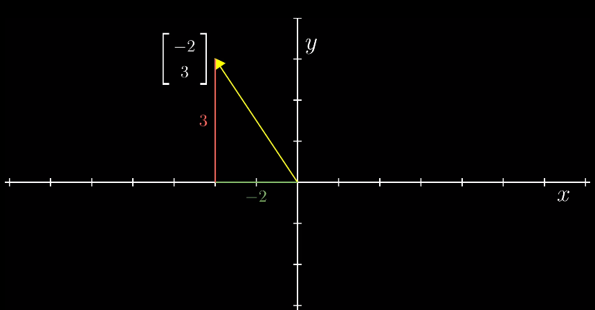

关于“向量”的概念就先说到这里。虽然本章节使用的向量基本都是二维直角坐标系中可以用箭头来表示的几何向量，但记住向量可以是任何东西，可以是多项式，是数组，是函数等等，只要能满足特定的性质即可。

1.2 向量的运算
-------------------

1.2.1 向量的加法
^^^^^^^^^^^^^^^^^^

如果将向量看看成是某种形式的运动，那么两个向量相加就是相继执行向量对应的运动。以下图两个向量为例，先沿 x 轴正方向移动 1 + 3 个单位，再沿 y 轴正方向移动 2 + (-1) 个单位，最终的结果就是两个向量相加的结果。这也对应了向量加法的数学形式，即把向量中对应的元素相加。

.. image:: images/向量加法.png

1.2.2 向量的数乘
^^^^^^^^^^^^^^^^^^

向量的数乘运算就是对向量进行缩放，更精确的说是将向量中的各个元素分别进行缩放。例如，乘以2相当于将这个向量拉长为原来的两倍，乘以1/3相当于将这个向量缩短为原来的1/3，乘以-1相当于将这个向量调转方向。这个拉伸、压缩以及反向的过程就称为“缩放”。这里的2、1/3、-1或任何用于缩放的数值，称为“标量” scalar。标量，就是一个单独的数字，一般用小写英文字母来表示。

.. image:: images/向量的数乘.png

2. 线性组合、张成的空间与基 Linear Combination, Span and Basis
==================================================================

2.1 运算封闭
----------------

运算封闭是数学中一个重要概念。对于一个集合，如果其中任意两个数在进行一种运算后，结果仍在这个集合中，那么我们说这个集合对于这种运算是封闭的。

换句话说，封闭研究这样一个问题：当我定义了一种运算后，所可能产生的所有结果是什么？对于向量而言，问题就是，当我初始拥有了一定数量的向量后，对他（们）进行加法和数乘运算，所可能产生的整个向量集合是什么？这就引出了向量空间的概念，我们之后会讲到。

2.2 线性组合
----------------

以二维平面直角坐标系为例，i, j 分别是沿xy坐标轴方向的单位向量(1,0) 与 (0,1)。那么，坐标平面上的任意一个向量，都可以看作是 i 和 j （称为基向量）的缩放再相加的结果。基向量缩放的倍数对应向量的各个分量，即向量对应的坐标。例如，向量 (3,-2) 就可以看成是 3倍i 与 -2倍j 相加的结果。

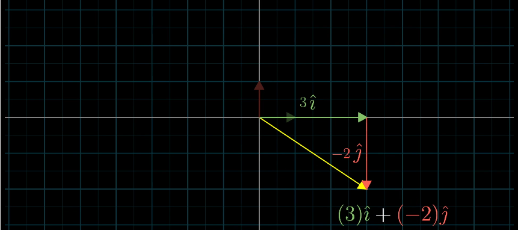

**一组基向量就对应一个坐标系，选择不同的基向量就构造出了不同的坐标系。** 同一个向量，在不同的坐标系下（即采用不同的基向量），其坐标值也要相应地发生变化。

这一“将向量进行缩放再相加”的操作，即 **线性组合** 。

.. image:: images/线性组合2.png

2.2 向量张成的空间
--------------------------------

在二维平面中，选取 2 个向量，然后考虑它们所有可能的线性组合，我们会得到什么呢？这取决于我们选择的 2 个向量。

通常情况下，我们会得到整个平面：

.. image:: images/张成1.png

如果不巧，选择的 2 个向量恰好共线的话，那它们的线性组合就被局限在一条过原点的直线上了。

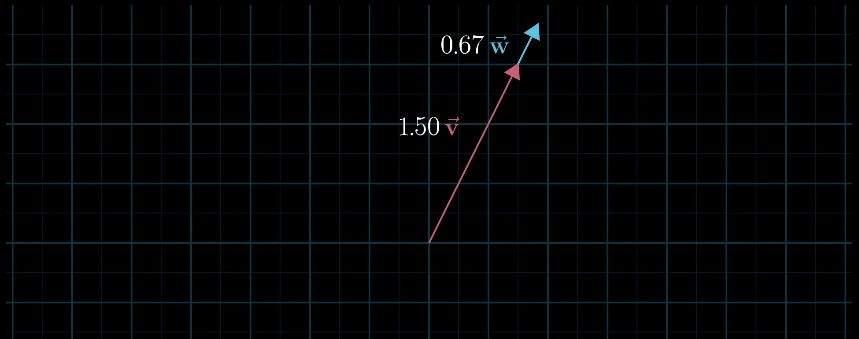

向量 v, w 的 全部线性组合所构成的向量集合称为向量 v, w 所  **张成的空间** 。张成的空间，实际上就是通过加法和数乘这两种运算，能获得的所有可能的向量集合是什么。

.. image:: images/张成3.png

2.3 线性相关与线性无关
--------------------------------

将线性组合的想法扩展到 3 维空间中。想象 3 个 3 维向量，它们所张成的空间会是什么样的呢？这取决于我们选择的 3 个向量。

  - a. 通常情况下，我们会得到整个 3 维空间
  - b. 当选择的 3 个向量共面时，它们所张成的空间是一个过原点的平面
  - c. 当 3 个向量共线时，它们所张成的空间是一条过原点的直线
  - d. 当 3 个向量都是零向量时，它们所张成的空间只包含零向量
  
显然，在考虑向量所张成的空间时，有些向量是多余的。例如，情况 b ，确定一个平面只需要 2 个向量，而我们却用了 3 个向量，这意味着，有 1 个向量是多余的；情况 c，确定一条直线只需要 1 个向量就够了，而我们用了 3 个向量，有 2 个向量是多余的。数学上，我们用线性相关来描述这样的现象。

当我们说几个向量所构成的向量组 **线性相关** 时，意思是向量组中至少有一个向量都可以用向量组中其他向量的线性组合来表示出来。换句话讲，这个向量已经落在其他向量所张成的空间中，它对整个向量组张成的空间是没有贡献的，把它从向量组中拿掉，并不会影响向量组所张成的空间。从几何角度举个例子，如果二维平面中两个向量线性相关，则其中一个向量可以写成另一个向量的倍数形式（两向量共线）。

**线性无关** 指的是，向量组中的（任意）一个向量都无法用向量组中其他向量的线性组合表示出来。换句话说，向量组中的每一个向量都为向量组所张成的空间贡献了一个维度，每一个向量都缺一不可，少了任何一个向量，都会改变向量组所张成的空间。

关于线性相关与线性无关，以下是一些重要性质：

 - 一组向量组要么是线性相关，要么是线性无关，没有第三种情况。
 - 如果一组向量中有至少一个零向量，或有两个相同的向量，那它们肯定线性相关。
 - 

2.4 基的定义
----------------

.. image:: images/基.png

如果向量空间中的一组向量满足：互相线性无关，张成 V，则它们是向量空间 V 的一组 **基** 。该空间的任意向量都能表达为基向量的线性组合。基含有的向量的数量叫做维数（即该向量空间的维数，记作 dim(V)）。同一个向量空间可以有很多组基，它们的维数必定相等。

3. 矩阵与线性变换 Linear Transformation/Mapping
=====================================================

3.1 线性变换  
--------------------------------------------------

首先来理解线性变换。变换，本质就是函数。在微积分中，我们了解了函数描述了一种映射关系，输入内容，输出唯一与其对应的结果。在线性代数中，我们输入一个向量，输出另一个向量。

之所以用“变换”这个术语，其实暗示了我们能够以某种方式可视化 输入—-输出 关系，暗示我们要从运动的角度去理解这一过程。变换让向量从一个地方（对应输入向量），运动到了另一个地方（对应输出向量）。

如果用空间中的点来表示向量，则可以把变换可视化为下图这样：

.. image:: images/线性变换1.png

经过变换后，所有点运动到了新的位置：

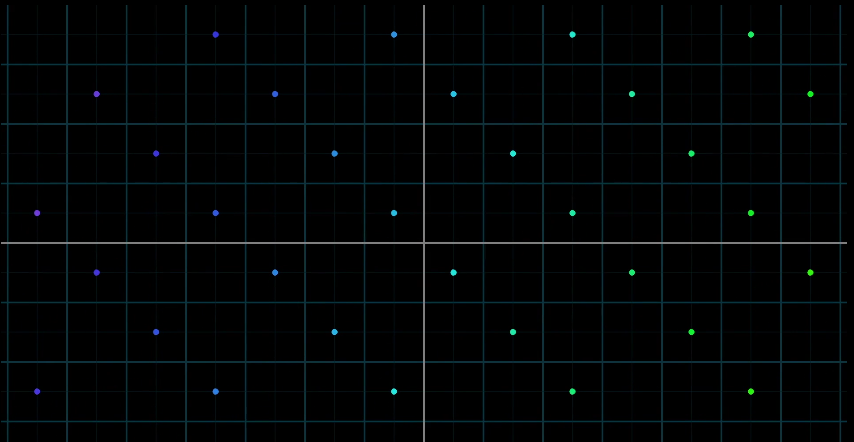

如果用等间距的平行网格来表示向量，则可以把变换可视化为下图这样：

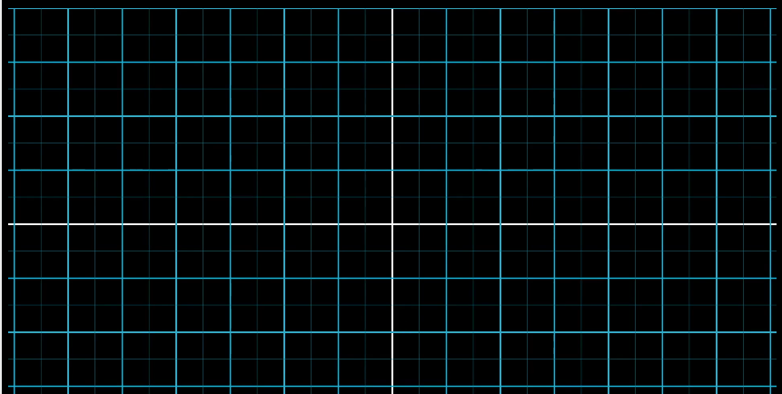

经过变换后，网格变成了这样：

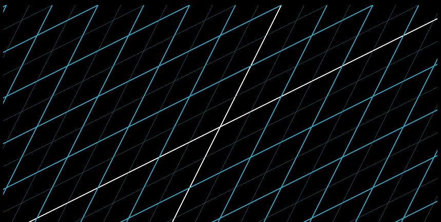

那么线性变换是什么意思呢？如果一个变换同时具有以下 2 条性质，则它是一个线性变换。

 - 变换前后，所有的直线仍然是直线
 - 变换前后，原点保持不变

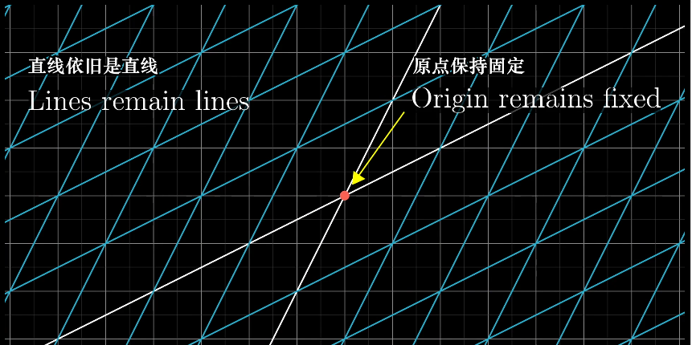

放在二维直角坐标系这一特定场景下，具体的体现就是施加线性变换后，整个坐标系的原点不变，并使网络线保持平行且等距分布。

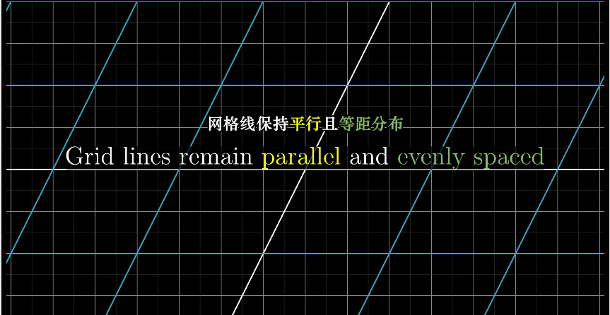

那么，我们要如何用数学语言描述一个线性变换呢？答案很简单，我们只需要知道变化前后的两个基向量i 和 j 的位置。

以平面直接坐标系为例，假定我们有一个向量 v = [-1,2] ,由上一节可知，我们可以将它看成是 2 个基向量 i, j 的线性组合 v = -1i + 2j。

.. image:: images/线性变换7.png

在某个线性变换的作用下，i, j 以及 v 都运动到了新的位置。

.. image:: images/线性变换8.png

线性变换前后网络线保持平行且等距分布，这一性质有一个重要的推论：线性变换后的 v 仍然是变换后的 i 和 j 的线性组合，并且线性组合的系数和变换前一样（仍然是 -1 和 2）。

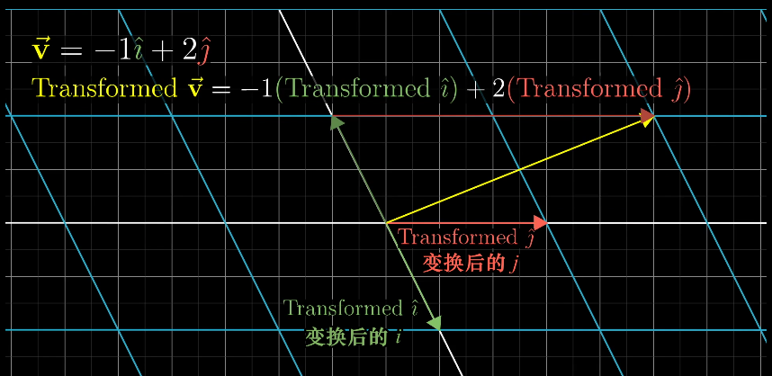

本例子中，变换后的基向量 i 和 j 分别是 [1,-2] 和 [3,0]。由此，我们可以轻松计算出变换后的v 的坐标是 [5,2]。

.. image:: images/线性变换10.png

事实上，我们只要知道线性变换之后的基向量 i, j 的位置（坐标），就可以计算出任意一个向量经过同样的线性变换之后的位置（坐标）。

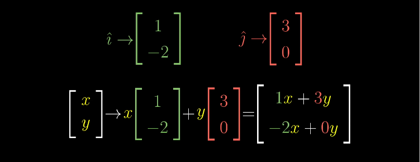

这意味着，对于一个线性变换，我们只需要跟踪基向量在变换前后的变化，就可以掌握整个空间（即全部向量）的变化。我们将线性变换后的基向量坐标按列组合起来，可以拼接成一个矩阵。线性变换的全部信息便都包含在这个矩阵当中了。

对于二维空间的线性变换，用一个 2×2 的矩阵就可以完全确定。这个矩阵的 2 列 表示 2 个转换后的基向量的坐标，如下图所示。

.. image:: images/线性变换12.png

那么，任何向量经过该线性变换之后，其新坐标的计算方法都是这样。记住，所有的变换都只是简单的“对基向量缩放再相加”。

.. image:: images/线性变换13.png
 
通过这种方式，是否可以更轻松的理解矩阵与向量的乘法？我们可以把矩阵的每一列看作变换后的基向量，它描述了一种特定的线性变换，而矩阵与向量的相乘，就是将这个线性变换作用于给定向量。

简而言之，选定基之后， **向量刻画对象，矩阵刻画对象的运动，用矩阵与向量的乘法施加运动；矩阵的本质是运动的描述。** 一旦理解了这点，线性代数之后的各个主题，包括矩阵乘法、基变换、特征值等都会非常直观易懂。

3.2 矩阵与基本运算
------------------------

上一节中，我们从线性变换的角度解释了矩阵的本质，下面我们简单温习下矩阵的基本数学概念。这些概念在任何一本代数教材中都可以轻易找到。

3.2.1 矩阵定义
^^^^^^^^^^^^^^^^^^^

矩阵：m * n 个数字排成 m * n 列的二维数组就是矩阵，一般用大写英文字母表示。若 m=n，即行数与列数相同，则称矩阵是n阶方阵或n阶矩阵。

.. image:: images/矩阵定义.png

3.2.2 矩阵的加法与数乘
^^^^^^^^^^^^^^^^^^^^^^^^^^^^^^^^^^^^^^^^^^^^^
矩阵加法，即将两个形状相同的矩阵的每一个对应位置的元素加起来。

.. image:: images/矩阵加法.png

矩阵数乘，即将一个矩阵每个元素乘以一个标量k。每个元素在数乘后变成原来的k倍。

3.2.3 矩阵乘法
^^^^^^^^^^^^^^^^^^^^^^^^^^^^^^^^^^^^^^^^^^^^^

矩阵加法和数乘都很好理解，让很多人头疼的矩阵乘法。
3.1 中我们提到，矩阵表示了一种线性变换。有些时候我们会进行多次线性变换，比如对向量先旋转再剪切，但无论经过多少次，最后的总体作用还是一个线性变换，这样的变换可以看做是由多个独立变换组合成的复合变换。

那么如何描述这类复合变换呢？一样道理。麻烦的方法是，我们把多个线性变换拆开分别看，例如下图，对向量先施加一个旋转变换，再施加一个剪切变换，注意矩阵是往左侧不断叠加的：

.. image:: images/复合变换1.png

表示的就是对给定的向量先进行旋转，再进行剪切。但无论中间过程是什么，最后的结果都应该和复合变换的结果完全相同。复合矩阵反应的是旋转+剪切的总体效应。从这个角度来说，新的这个矩阵（复合矩阵）可以看做最初两个矩阵的积。

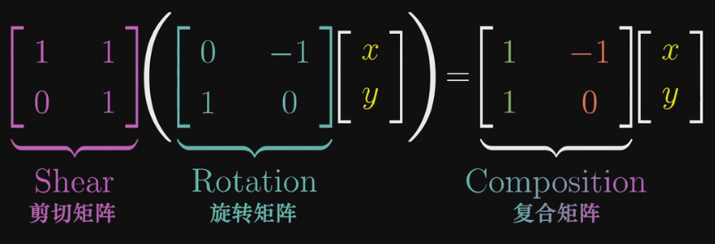

关键点到了。很多人对矩阵的乘法计算只知道死记硬背，但一旦理解了矩阵相乘内在的几何意义（即两个线性变换的相继作用），那么矩阵相乘就是手到擒来的事。

首先，需要记住一点，矩阵的相乘应该从右往左读，即先应用靠右边的变换，再依次向左。以下图的为例，假设我们的原始基向量是 i 和 j，经过矩阵 M1 和 M2 的作用后会变成怎样的新基向量呢？

可以看到，j 经过 M1 的作用后变成了 [-2,0]， [-2,0]再经过 M2 的转换变成了 [0,-2]，因此新的基向量 j 就是 [0,-2]，也就是复合矩阵的第二列。和矩阵乘以向量的机制完全一样。

.. image:: images/复合变换3.png

推广到任意矩阵，就得到了我们在教科书中常见的矩阵乘法公式：

.. image:: images/复合变换4.png

或者更广义的：

.. image:: images/矩阵乘法.png

如此，把矩阵乘法理解为 **连续的几次线性变换** ，我们也能很容易理解，矩阵 A*B 的结果和矩阵 B*A 的结果是不一样的，因为操作顺序的不同，产生的影响也不同。比如，先对 i 和 j 基向量先往x轴方向拉伸一倍，再顺时针旋转90度，与先旋转90度再拉伸，结果肯定不一样。

同样，我们也能轻易的理解矩阵乘法的结合律为什么合理了。你当然可以通过数学的方法证明等式左右两边的计算结果一致，但当你明白矩阵乘法实际的意义是相继的进行线性变换后，那么答案简直不言自明—— (AB)C 与 A(BC) 做的完全就是同一件事：先进行C变换，再进行B变换，最后进行A变换，根本不需要证明什么。 

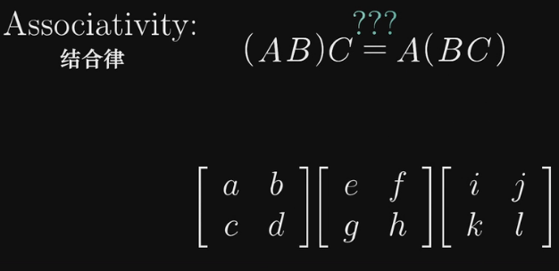

需要注意的是，矩阵的标准乘积（如上所述）不是矩阵中对应元素的乘积，但那样的矩阵操作也是存在的，称为元素对应乘积（element-wise product）或 Hadamard 乘积。

3.2.4 单位矩阵
^^^^^^^^^^^^^^^^^^^^^^^^^^^^^^^^^^^^^^^^^^^^^

单位矩阵：对角线为1，其余位置都为0 的矩阵，通常记作 I。任意向量与单位矩阵相乘，都不会改变，得到自身。

把矩阵理解为施加的线性变换，矩阵的每一列就是线性变换后的新的基向量坐标组合起来，那么单位矩阵对应的变换就是——什么都没做，因为新的基向量和原始的基向量一模一样。如此，便可以轻松的理解单位矩阵的各种性质，例如 A * I = A = I * A。

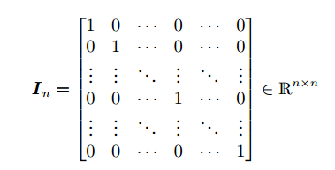

3.2.5 矩阵的性质
^^^^^^^^^^^^^^^^^^^^^^^^^^^^^^^^^^^^^^^^^^^^^

在了解了矩阵的加法、数乘、乘法、单位矩阵后，我们便可以认识一些矩阵的基本性质，包括结合律、分配律和中性元素。矩阵的结合律在 3.2.3 中我们已经提到过。

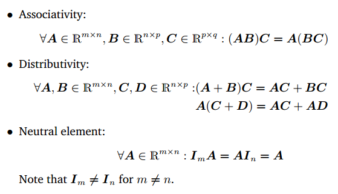

5. 行列式 Determinant 
=============================

之前通过网格线可视化线性变换的图片中我们可以看到，线性变换中有些将空间向外拉伸，有些将空间向内挤压，有件事对理解这些变换很有用，就是测量线性变换具体对空间产生了多少拉伸或压缩，换句话说，就是测量一个给定区域面积扩大或减小的比例。

以下图为例，假设我们的新基向量是[3,0] 和 [0,2]，经过变换后，原先 1*1 的单位正方形区域的面积变成了 3*2 = 6 即原来的6倍。

.. image:: images/行列式1.png

实际上，我们只需要观察这个单位正方形变换后的面积变化比例，就等于知道了其他任意区域的面积变化比例，因为对于其他任意的方块来说都会有相同的变化，这是由线性变换产生网格线保持平行且等距分布这一特性推断出的。而这个变化的比例，就是我们常说的行列式。

如果说一个线性变换的行列式是3，那就是说它将一个区域的面积变化为原先的3倍。

.. image:: images/行列式2.png

如果一个线性变换的行列式为0，则说明它将原来的二维平面压缩到了一条线（甚至一个点）上，此时所有区域的面积都为0。换句话说，探究一个矩阵的行列式是否为0，就能了解这个矩阵对应的线性变换是否将空间压缩到了更低维度（例如从二维降维到一维空间）。

.. image:: images/行列式3.png

行列式还可能是负值。从几何意义上如何理解将面积变化为原来的负数倍呢？如果将二维空间想象成一张白纸，那么这个变换相当于将纸张翻转到了另一面。这类变换改变了空间的定向。因此，负值表示空间翻转了，但行列式的绝对值仍然表示区域面积的缩放比例。

放到三维空间中，行列式的意义依然相同，告诉我们单位体积（即1*1*1的立方体）在变换后的缩放比例。当行列式为0时，这个立方体降维成了一个平面或一条直线，甚至一个点。

**行列式的计算**

二维矩阵的行列式计算公式很简单，但下图可以帮我们理解为什么是这样。 ad - bc 的结果就是黄色平行四边形的面积，也就是相对于单位正方形变化的比例。

.. image:: images/行列式4.png

然而就我个人而言，这些计算完全可以由电脑完成，死记硬背行列式的计算公式、甚至三阶、四阶行列式的公式并无太大意义，理解背后的意义和原因才更重要。这也是很多人觉得学习线性代数痛苦的原因，国内的大部分课本只会让你沉浸于各种奇怪的计算数学符号中，却根本无法让你知道为什么会是这样。比如下面这个定理：

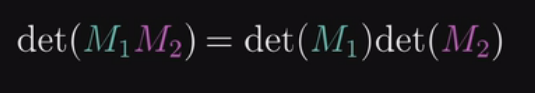

两个矩阵相乘的行列式，等于矩阵各自行列式的乘积。

如果用数值的方法证明，大概可以写5张A4纸。但如果你明白了行列式的本质，那又是不言自明：左边的等式代表先进行 M2 矩阵代表的线性变换再执行 M1 所代表的线性变换之后，面积或者体积所变化的比例。右边的式子是两个线性变换使面积或体积变化的比例的乘积。因为两边线性变换之后的结果是一样的（执行顺序一样），所以比例肯定也是一样的

6. 逆矩阵、秩、列空间、与零空间
===============================================

6.1 逆矩阵
--------------

前面章节中，我们通过线性变换理解矩阵与向量的运算，这一章我们仍然用线性变换来理解逆矩阵、列空间与零空间这三大概念。Again，个人以为理解这些概念的意义比会计算重要的多，因此计算方法，例如高斯消元法、行阶梯形等不会在这里介绍。

我们都知道，矩阵的一大用途的帮助我们解方程组，比如，我们可以将一个方程组写为以下线性方程组的形式：

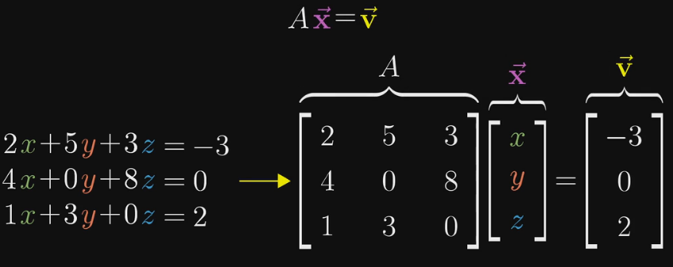

这里，矩阵代表了某个线性变换，所以从几何意义上理解，求解该方程组的未知量 x,y,z 等同于寻找一个向量 x，使得它在经过 A 的变换后与向量 v 重合。

我们来看一个二元方程组：

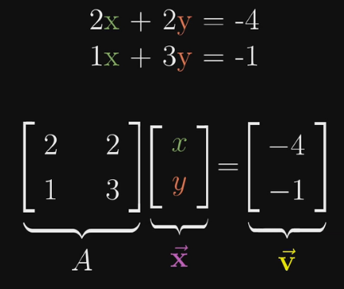

这个方程组 Ax = v 的解依赖于矩阵 A 所代表的变换，是将原始空间挤压到一个更低维空间，还是保持不变，即 A 的行列式是否是0.

如果行列式不为0，即空间的维度不变，那么只可能有一个向量在变换后与 v 重合，可以通过对 v 做逆变换来得到 x 向量。这里对 v 的逆变换就对应了另一个线性变换，也称为 A 的逆。例如，如果 A 变换是顺时针旋转90度，那么 A 的逆就是逆时针旋转90度。简单的说，如果先施加 A 变换，再施加 A 的逆，那么又回到原始状态。由此，我们给出逆矩阵的正式定义：

.. image:: images/逆矩阵.png

当我们通过计算机得到 A 的逆矩阵后，求解向量 x 也就迎刃而解了，在等式两边同左乘 A 的逆即可。其几何意义对应于对 v 进行逆向的变换，还原为 x。 值得注意的是，不是所有的矩阵都有逆矩阵。存在逆矩阵的矩阵也称为 **非奇异矩阵** ，不存在逆矩阵的矩阵称为 **奇异矩阵** 。

.. image:: images/逆矩阵1.png

**如果行列式为0，矩阵 A 所代表的变换将空间压缩到了更低的维度上，此时 A 没有相应的逆变换** ，直观的理解就是我们没有办法将一个低维空间的东西变换到高维空间（比如把一条直线还原到一个平面），因为高维的空间包含更多的信息，压缩成低维后那些信息都已经丢失了，不可能恢复那些丢失的信息。

行列式为0时，方程式的解可能也存在，就要看变换后的向量 v 是否在变换后的空间内，如果不在，就无解，如果在，就有无数解。

在很多教科书上，你会读到这样一段解释： **方程组 Ax = v 有解当且仅当 v 是 A 的各列的线性组合** 。细心体会一下，这与我们上一段说的其实是一回事。

除了用行列式为0来描述矩阵变换后的结果，我们还可以更精确的描述变换后空间的维数，这里就引入了一个新的概念：秩。

6.2 矩阵的秩 Rank
--------------------

6.2.1 秩的定义
^^^^^^^^^^^^^^^^^^^^^^^

**秩** 就代表了变换后空间的维数。如果变换后所有的向量都落在一条直线上，那么这个变换的秩为1；如果变换后所有的向量都落在一个二维空间上，那么这个变换的秩为2。

对于一个 2*2 的矩阵来说，它的秩最大只能为2，因为它的2个基向量最多张成二维空间。对于 3*3 的矩阵，它变换后的结果可能为一个一维、二维或三维空间。

更正式的定义：一个矩阵 A 的列秩是 A 的线性无关的列的极大数目。类似地，行秩是 A 的线性无关的行的极大数目。矩阵的列秩和行秩总是相等的，因此它们可以简单地称作矩阵 A 的秩。

6.2.2 秩的重要性质
^^^^^^^^^^^^^^^^^^^^^^^^^^^^^^^^

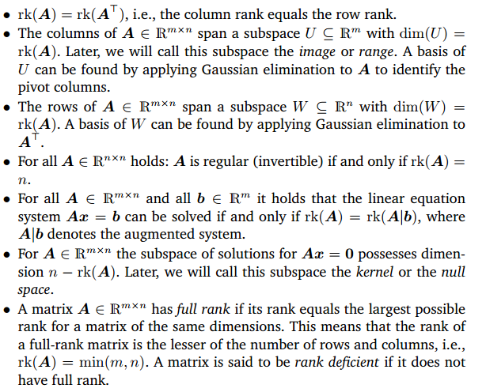

看看就行。

6.3 列空间 Column Space
-----------------------------

对向量 x 施加线性变换，变换矩阵的各列可以看作基向量变换后的坐标，变换矩阵的各列张成的空间就是 **列空间** 。所以矩阵的秩也可以理解为，列空间的维数。秩最大的情况就是与矩阵的列数相等，称为满秩。

值得注意的是，零向量，即原点一定包含在任何列空间里，因为线性变换必须保持原点位置不变。对于满秩变换来说，原点是唯一变换前后不变的向量，但对于非满秩变换来说，可能有一系列的向量在变换后变成了零向量。为什么呢？

6.4 零空间 Null Space/Kernel
--------------------------------

想象一下，如果一个线性变换将2D空间压缩到一条直线上，那么沿着某个特定方向直线上的所有点都会被压缩到原点（想象把一张纸压成一条线）。同样的，如果将一个3D空间压缩到一个平面上，也会有一整条直线上的向量变换后落在原点（想象把一个立方体压成一张纸），如果将一个3D空间压缩到一条直线上，那就会有一整个平面上的向量变换后落在原点。

变换后落在原点的向量的集合，称为矩阵的 **零空间** 或者核(kernel)。

.. image:: images/零空间.png

如上图所示，假设 V → W 是一个线性变换， **象** （Image）指的就是所有V中的向量所能映射到的W中的所有向量， **核** （Kernel）指的就是V中映射为W中零向量的元素整体。根据定义，零空间就是线性齐次方程组 Ax = 0 的所有解的集合。

最后，总结一下，变换矩阵是满秩，等价于矩阵各列向量线性无关，等价于矩阵的行列式不为0，等价于 Ax=0 仅有唯一解零向量，等价于矩阵存在逆矩阵。

7. 非方阵
======================

之前我们讨论的矩阵都是方阵，例如用 2*2 的矩阵表示二维向量到二维向量的变换。那么如何理解非方阵呢？很简单，仍然是线性变换，但是是从某个维度转换为另一个维度的坐标。

以一个 3*2 的矩阵为例，它的几何意义是将输入的二维空间映射到三围空间上。 矩阵有2列表示输入空间有2个基向量（因此是二维输入空间），有3行表示每一个基向量在变换后用3个独立的坐标来描述。

8. 模、点积与正交矩阵
=======================

8.1 向量的模 Norms
-------------------------------------

当我们在几何平面上表达向量时，我们容易理解一个向量的“长度”即它从原点到箭头终点的线段长度，这就引出了模的概念。

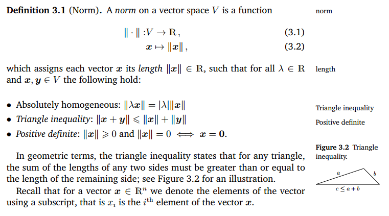

只要满足以上3条性质，就是广义上的模。最常见的模即 L1 和 L2 Norm，俗称曼哈顿距离和欧氏距离：

.. image:: images/L1 norm.png

.. image:: images/L2 norm.png

8.2 向量点积 Dot Product
-------------------------------------
 
向量的点积（也称为内积/数量积），就是对两个向量对应位置的元素一一相乘之后求和，结果是一个标量。如果对一个向量本身进行点积，得到的其实就是该向量的 L2 模的平方。

.. image:: images/点积1.png

从几何角度理解，向量之间的点积就是其中一个向量在另一个向量上的投影长度，乘以另一个向量的长度。因此，点积的主要用途就是判断向量之间是否正交。

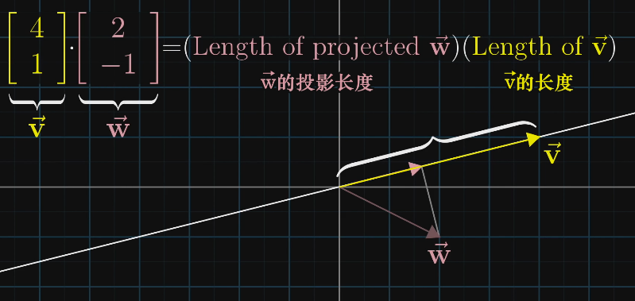

很显然的，如果两个向量方向垂直（正交），点积的结果为0。如果方向相反，点积的结果为负值。当方向完全一致时，点积的值最大。

这两者是如何联系起来的？

首先，我们有一个从二维空间到数轴的线性变换，假设我们并不知道什么向量的点积运算公式，而只是将空间上的点投影到数轴上。

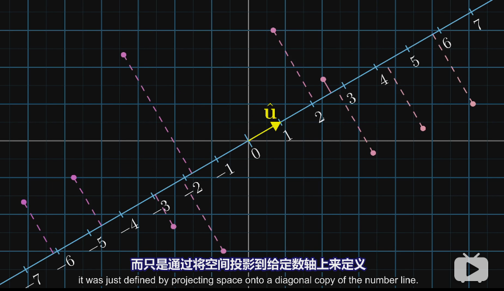

因为这个变换是线性的，所以必然可以用一个1行2列的矩阵描述。这个矩阵 [ux uy] 即变换后的基向量 i 和 j 的坐标，也就是基向量在新数轴上的投影。

.. image:: images/点积5.png

而又因为1*2矩阵与一个二维向量相乘的过程，和将这个矩阵转置过来，与向量做点积的过程相同，所以这个投影的变换必定与某个二维向量有关。

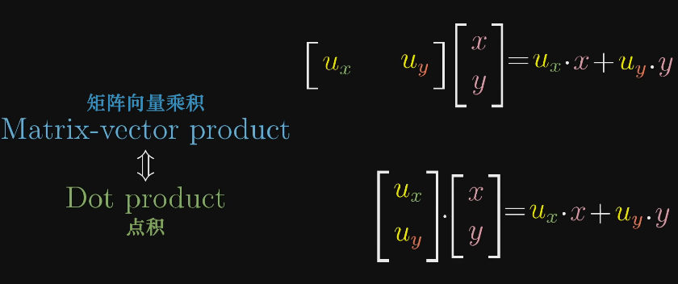

由此我们得到结论，任何时候一个线性变换，如果输出空间是一维的数轴，不管这个变换是如何定义的，空间都会存在一个唯一的向量与这个变换相关，施加该线性变换和做点积效果是一样的。换句话说，两个向量的点积，就是将其中一个向量转换为线性变换，施加在另一个向量上。

这是数学中对偶性的一个体现。一个向量的对偶，是它定义的线性变换。一个多维空间到一维空间的线性变换的对偶，就是多维空间中的某个特定向量。

8.3 正定矩阵
-------------------------------------
 
正定矩阵在机器学习，特别是矩阵分解中起着重要作用，它与向量点积密切相关。

定义:A是n阶对称方阵，如果对任何非零向量x，都有 :math:`x^{T}Ax > 0`  (其中 :math:`x^{T}` 表示x的转置)，就称A是正定矩阵。 如果把等式的符号改为 >=0，则称A是半正定矩阵。

从直观的角度理解，Ax 是对向量 x 施加线性变换A，假设变换后的向量 y = Ax，则正定矩阵可以改写为：xy > 0，即这两个向量的点积大于0，从几何上就是说，这两个向量的方向一致（夹角小于90度）。因此，正定、半正定矩阵表示的是一个向量经过该矩阵对应的线性变化后的向量，与其本身的夹角小于(等于)90度。

从正定矩阵的定义 :math:`x^{T}Ax > 0` 我们也能推导出对于任何非零向量 x， Ax != 0 ，因此要让 Ax = 0 成立则 x 只能是零向量，即正定矩阵 A 的零空间只包含一个零向量。另外，正定矩阵的对角线上的元素全部为正，通过令 x 为单位向量即可证明得到。

8.4 夹角与正交性
-------------------------

8.4.1 向量的夹角
^^^^^^^^^^^^^^^^^^^^^^^^^^

8.2 中我们已经提过，从几何角度理解，向量之间的点积就是其中一个向量在另一个向量上的投影长度，乘以另一个向量的长度，即两个向量的模（长度）的乘积，再乘以向量夹角的余弦值。因此，这个夹角的计算公式可以写为：

.. image:: images/夹角公式.png

两向量的点积如果是0，则称它们互相正交。如果两个向量的模都等于1，则称为标准正交。

8.4.2 正交矩阵
^^^^^^^^^^^^^^^^^^^^^^^^^^

定义：如果一个方阵满足：

.. image:: images/正交矩阵.png

则称为正交矩阵。正交矩阵的各行（列）向量都是标准正交向量。

8.4.3 标准正交基
^^^^^^^^^^^^^^^^^^^^^^^^^^

如果向量空间的一组基互相正交，且基向量的长度都是1，则这样的基称为标准正交基。这个概念在支持向量机、主成分分解算法中非常重要。

.. image:: images/标准正交基.png

8.4.4 正交投影（TODO）
^^^^^^^^^^^^^^^^^^^^^^^^^^^^

9. 叉积
====================

两个二维向量的叉积的大小，等于这两个向量构成的平行四边形的面积。同时，这个面积也是有正负号的，如果向量 v 叉积 w，v 在 w 的左侧，则面积为负。

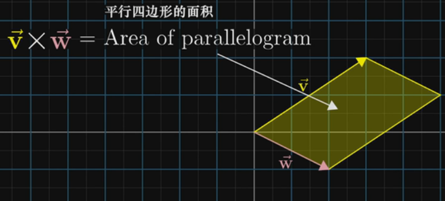

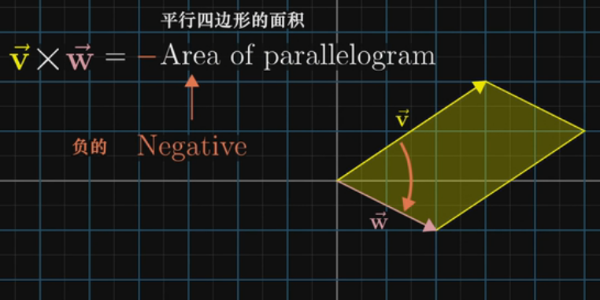

要计算叉积的值，就要用到之前行列式的概念。记得行列式表示的是线性变换后单位区域的面积缩放的比例，在这里就相当于我们要计算的平行四边形的面积，因为这个平行四边形就来源于面积为1的单位正方形。

两个三维向量的叉积，结果是一个新的三维向量。这个向量必然与原来两个向量确定的平面垂直，并且其长度与这两个向量张成的平行四边形的面积相同。

.. image:: images/叉积3.png

10. 基变换 Basis Change
================================
 
在直角坐标系中，任何一个向量（点的坐标）都可以看做是对 **基向量 i 和 j 缩放的标量** 。将这两个经过缩放的基向量相加就是坐标要描述的向量。

.. image:: images/基变换1.png

这个视角下，任何一个向量的第一个数字可以看成是（从原点）向右的运动，第二个数字是向上的运动，而这个事实取决于与我们选择的基向量 i [1,0] 和 j [0,1]，因为这两个向量是我们进行缩放的对象。那么如果我们使用不同的基向量会怎么样？

假设现在我们有了另一组基向量 b1 和 b2，在我们的原始坐标系中，我们用 [2,1] 来描述 b1，[-1,1] 来描述 b2.

.. image:: images/基变换2.png

于是，虽然我们关注的是空间中的同一个向量，但在原坐标系中它是[3,2]，在新的坐标系中就是另一个表达了（不过记住，无论是什么坐标系，原点是同一个）。这就好比两种语言描述同一个事物。

那么如何在不同的坐标系之间互相转化呢？

先看如何把新坐标系中向量的坐标转换为老坐标系。很简单，用新坐标系中的向量的坐标，数乘用老坐标系表达的新基向量，就得到了在老坐标系中向量的对应表达（黄色向量）。

.. image:: images/基变换3.png

注意，这就是一个矩阵与向量的乘法。我们之前已经从几何上理解了，矩阵向量乘法相当于对向量做了一个特定的线性变换，这里也可以同样的方法去理解。这个由新坐标系中的基向量构成的矩阵可以看成是一个线性变换，它将老坐标系中的基向量 i 和 j 转换成新基向量 [2,1] [-1,1].

同理，已知老坐标系中向量的坐标，如何知道它在新坐标系中的坐标呢？很简单，逆向变换一下，用老坐标系中向量的坐标，乘以新的基向量构成的矩阵的逆就行了。

用两张图总结一下不同坐标系之间的相互转化：

.. image:: images/基变换4.png

.. image:: images/基变换5.png

上面我们讲了如何在不同坐标系上表达同一个向量，那么如何用类似的道理来描述不同坐标系上的同一个线性变换（矩阵）呢？例如，我们知道在老坐标系中，逆时针90度的旋转可以用矩阵：

.. image:: images/基变换6.png

来表示。注意，我们的原始基向量 i[1,0] 和 j[0,1] 经过90度旋转后变成了 [0,1] 和 [-1,0], 组合在一起就变成了我们的变换矩阵。那么如何在新坐标系中描述这个变换呢？

首先从新坐标系的任一向量出发，例如 [-1,2]。

然后，对其施加基变换，即乘以新的基向量构成的矩阵。这时得到了该向量在老坐标系中的表达。

.. image:: images/基变换7.png

接着，把结果左乘我们老坐标系下的线性变换矩阵，这时就得到了变换后的向量，不过是用老的坐标系描述的。

.. image:: images/基变换8.png

最后，左乘新基向量变换矩阵的的逆，大功告成！它接收任何用新坐标系描述的向量，输出用新坐标系描述的变换后的向量。

.. image:: images/基变换9.png

总的来说，每当我们遇到这样一个式子 :math:`A^{-1} MA` 的时候，这就暗示着一种数学上的转移作用，中间的矩阵代表着一种所见的变换，另外两个矩阵代表着转移作用，也就是视角(坐标系\基)的变化，矩阵的乘积还是代表着同一种变换，只不过是从其他人的视角来看的。

这里也引出了 **相似矩阵** 的概念。对于同一个线性变换，不同基下的矩阵，称为相似矩阵。对于相似矩阵，它们的特征值、行列式和矩阵的迹都一致，因此这几个参数就是描述一个线性变换的关键，因为它们都和矩阵选择的基无关。

11. 特征向量、特征值、特征分解与奇异值分解
================================================

11.1 特征向量与特征值
------------------------
与行列式类似，矩阵的特征值和特征向量提供了一个新的角度来“描述”矩阵的特性。一个矩阵代表的线性变换通常可以由其特征值和特征向量完全描述。

对于矩阵向量乘积，有两种情况：大多数情况下,向量经过线性变换后离开了其所张成的空间（该向量所在直线所有向量的集合），但是一些特殊的向量留在他们张成的空间中。意味着 **矩阵对它的作用仅仅是拉伸或者压缩** ，矩阵对于该向量的乘法作用只相当于一个标量。用数学的语言说，就是这样：

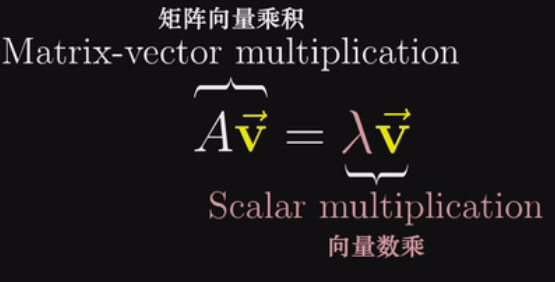

以下图中的变换矩阵为例，基向量 i 在该矩阵的变换作用后，仅仅是沿着x轴方向拉伸了3倍，而 i 张成的空间是x轴，因此向量 i 经过线性变换后仍然留在其张成的空间中。

.. image:: images/特征向量1.png

这些特殊的向量就叫做特征向量，伸缩变换的比例叫做特征值。注意，特征值可以有正有负，对应着方向。此外，也容易看到，和基向量 i 共线的任意向量也和 i 一样，在矩阵的作用后只是拉伸为了原来的3倍，因此任意向量 ci 也是该矩阵的特征向量，具有相同的特征值。对于一个矩阵来说，相同特征值的特征向量的集合称之为 **特征空间** 。 

二维线性变换矩阵不一定有特征向量，例如旋转90度就没有（严格的说是没有实数特征向量），因为每个向量都发生了旋转离开了它张成的空间。

另外，关于特征值，还有几个有趣的定理：

- 矩阵的行列式等于其特征值的乘积
- 矩阵的迹（对角线元素之和）等于其特征值之和

11.2 矩阵的对角化与特征分解
----------------------------------

对角矩阵，即除了对角线之外所有元素都为0的矩阵，结构简单，计算行列式、矩阵的幂和逆都相当迅速。对角矩阵的行列式就是对角线上所有元素的乘积，其k次幂就是把对角线上每个元素进行k次幂计算，其逆矩阵就是对角线上每个元素的倒数（除了0之外）。因此，如果能把一个矩阵转换到对角矩阵的形式，会使得计算方便很多。

在知晓了特征向量和特征值的概念之后，如果转换矩阵的基向量恰好是特征向量的话，则将坐标系变换后（基向量变换后），对应的变换矩阵将变成一个对角矩阵，对角元是特征向量对应的特征值。如果变换矩阵有足够的特征向量来张成初始矩阵的列向量所张成的空间的话，那么就我们就可以通过变换坐标系，把原矩阵变成对角矩阵。

在上一节已经讲到可以通过  :math:`A^{-1} MA` 这种形式将一个线性变换矩阵转移到另一个坐标系的表达，那么矩阵对角化就是将原矩阵转变到特征基的坐标系。

例如，我们已经知道原始变换矩阵：

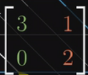

对应的两个特征向量是 [1,0] [-1,1]，那么经过

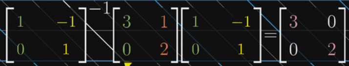

形式的变换，产生的新矩阵必然是对角矩阵，对角元对应特征值。要计算上述变换矩阵的100次幂，可以先将它转换到特征基，在那个新坐标系中计算100次幂，然后再转换回老的坐标系中。

因此，如果存在一个矩阵 A 使得原始矩阵 M 经过  :math:`D = A^{-1} MA` 变换后能得到对角矩阵 D，则称 M 是可对角化的，换言之 M 是可对角化的等同于存在一个相似矩阵并且是对角矩阵。

对矩阵进行 **特征分解** 就是把原矩阵分解为其特征值与特征向量的矩阵之积的形式，即  :math:`M = ADA^{-1}`  ，也就是上述对角化的逆运算，本质上说的是一件事。D 是对角矩阵，对角线上的元素就是 M 的特征值，D 的维数就是 M 有多少个线性无关的特征向量（即 A 的秩）。

只有方阵才能进行特征分解。对于对称矩阵来说，它总是可对角化的。但如果不是对称矩阵，则不能保证可以转化为对角矩阵。那么对于非方阵，能不能进行类似的分解操作呢？ 答案是奇异值分解，我们在下一章中介绍。

11.3 奇异值分解 Singular Value Decomposition
-----------------------------------------------

奇异值分解，简写 SVD，被认为是线性代数中最基本最核心的理论，因为它能作用于任何矩阵。在现实应用中，奇异值被广泛使用在图像压缩、推荐系统、主成份分析算法中。关于如何理解奇异值分解，`知乎问答 <https://www.zhihu.com/question/22237507#answer-16927902>`__  已经有了非常精彩的解释，想要具体了解的同学可以移步学习。这里只简单记录一下其核心内容。

**奇异值分解**

假设 A 是一个 m*n 的矩阵，则如下的分解称为奇异值分解。

.. image:: images/奇异值1.png

其中，U 是 m*m 的由一组标准正交基组成的矩阵，V 也是 n*n 的标准正交基组成的矩阵，Σ 矩阵在非对角线上的元素均为0，对角线上的元素>=0，代表奇异值。如果 Σ 矩阵的行多于列（即 m>n）则多余的行全部以0填充，反之亦然。

从数学形式上讲，奇异值分解将一个矩阵代表的线性变换，拆解成了三部分：首先，进行一次基的变化（VT），然后进行缩放，并可能在维度上有增减（Σ），最后，进行第二次基变化（U）。更简单的讲，奇异值分解将任何矩阵变化分为了三部分：将坐标系旋转，再拉伸，最后再旋转到最终位置。

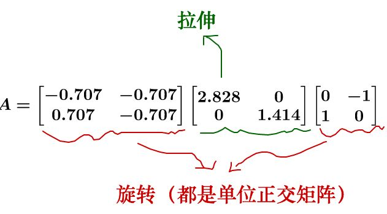

从几何角度来理解，奇异值分解的涵义是，对于任何一个矩阵，首先找到一组两两正交的单位向量，使得矩阵作用于该单位向量组后得到的新向量仍然是两两正交的，奇异值的涵义就是变换后新向量各自对应的长度。

.. image:: images/奇异值2.png

以上图为例，VT 起了一个基变化的作用，将原本的正交基向量（左上图的 v1 v2）转变到了新的正交基向量（左下图的 e1 e2）。注意由于 V 是由标准正交基组成的正交矩阵，因此 VT 就等于 V 的逆。

然后，奇异值矩阵 Σ 将新坐标系进行缩放（缩放比例即奇异值），并且可能增加或降低维度。图中的例子从二维变化到了三维。（右下图）

最后，U 又做了一次基变换，并且变化后的基向量扩充到了三维空间。（右上图）

**低秩近似**

奇异值分解的一大用途就是低秩近似，即将原来的大的矩阵用若干个小的简单的秩一矩阵的和来替代，从而大大减小消耗的存储量。方法即把原来的 SVD 分解表达式：

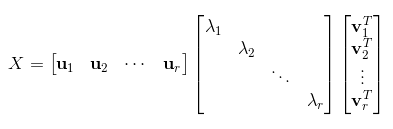

拆写为：

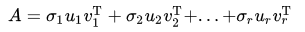

其中 r<k，每一项的系数 σ 即奇异值，且奇异值的大小依次降低，每一项的 uv 即一个单位向量与另一个单位向量的转置的乘积，结果就是一个秩一矩阵。保留前 r 个含有较大奇异值的项，就能得到原始矩阵的很好的近似。

注意，一个列向量和一个行向量（即uv）的积一定是个秩一矩阵，因为所得到的一个 m*n 矩阵的每一行（列）都是原行向量（列向量）的线性组合，因此该矩阵的秩一定为一。

12. 抽象的向量空间 Vector Space
=====================================

我们再来回顾下什么是向量？是一个有方向的箭头，亦或是有序的列表？还是这两种观点是更深层次抽象事物的体现？

可以先讨论一个新的事物——函数，某种意义上函数也是一种向量，例如两个函数f(x)和g(x)，可以将两个函数相加可以得到新函数(f+g)(x),这和向量对应坐标的相加类似,只不过某种程度来说，函数有无数多个坐标要相加。类似的，对于函数与另一个数的数乘 (2f)(x)=2f(x)，也和向量对应坐标的数乘类似。

因此，以空间箭头为背景考虑的线性代数的概念和解决问题的手段也可以应用于函数，例如对函数的线性变换。那么怎么理解一个函数的变换是线性的呢？满足以下两条性质即可。

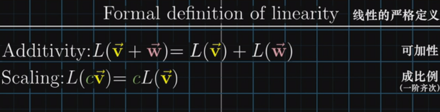

例如，对函数求导就是线性运算，因为它满足以上两条性质。两个函数相加再求导数，与分别求导数再相加的结果一致。乘法也一样。

**矩阵求导**

如果用矩阵来描述求导，该如何做？以多项式函数为例，我们可以把每一项的系数作为向量，把x的多次项作为基函数（基向量），而因为多项式的次数可以任意高，所以基函数集合也是无穷大的。因此，把一个多项式函数表达为矩阵就像下面这样：

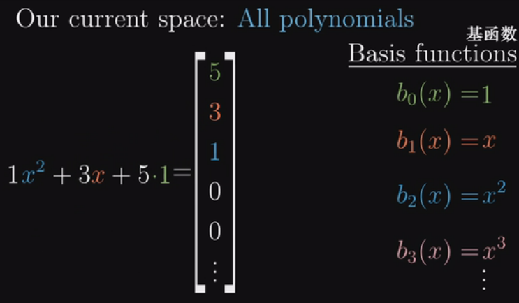

对一个多项式函数求导，就能表达成下面这样：

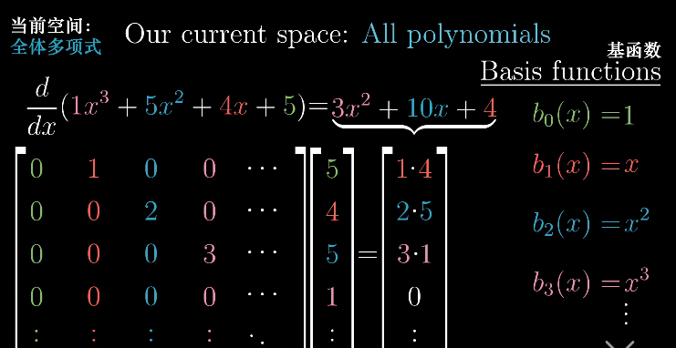

所以，函数求导和矩阵向量乘法这两件事，看似毫无关联，其实完全可以理解成同一件事。实际上，线性代数中关于向量的很多概念，在应用于函数时有直接的类比。

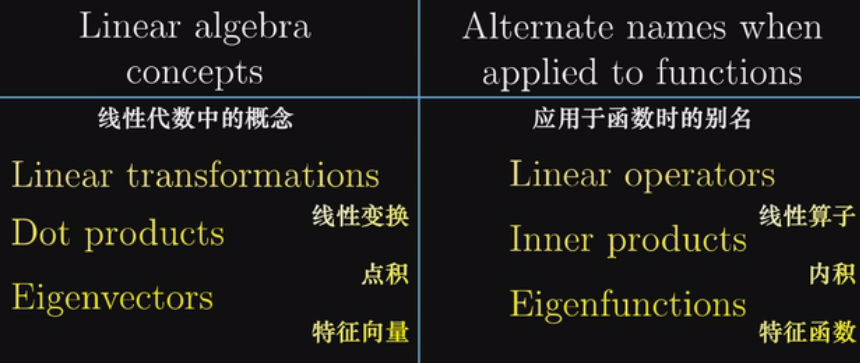

所以，其实数学中有很多类似向量的事物，只要处理的对象集有数乘和相加的概念，无论是箭头、数组还是函数，线性代数中所有关于向量、线性变换和其它的概念都适用它。这些类似向量的事物，箭头也好函数也好，它们构成的集合叫做“向量空间”。

12.1 向量空间的公理
----------------------------

定义  令 V 为一个定义了加法和标量乘法运算的集合，这意味着对 V 中的每一对元素 v 和 w，可唯一对应于 V 中的一个元素 v+w，且对每一个 V 中的元素 x 和每一个标量 α，可唯一对应于 V 中的元素 αx 。如果集合 V 连同其上的加法和标量乘法运算满足以下的八条公理，则称为 **向量空间** 。

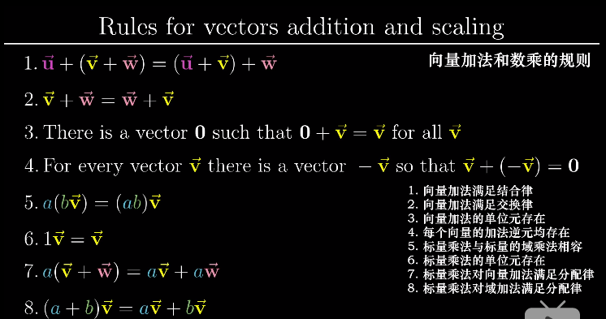

上边的八项公理，是建立一系列向量加法和数乘必须遵守的规则。因此如果要让所有建立好的理论和概念适用于一个向量空间，那么它必须满足上述的公理。

向量的具体形式并不重要，只要它们相加和数乘的概念遵守向量加法和数乘的八项规则，它就是向量。

12.2 向量子空间
----------------------

如果有一个向量空间 V 的一个非空子集合 S，且 S 对于加法和标量乘法都封闭，则称 S 是 V 的 **子空间** 。以 S 为全集的数学系统连同从向量空间 V 继承的两个运算满足向量空间定义中的所有条件。向量空间的任何一个子空间仍然是向量空间。

12.3 仿射子空间
----------------------

仿射子空间是一种更一般的空间。对于向量空间V中的一个非空的子集S，如果满足下面的条件，它就被称为仿射子空间：

集合S = { u - v  |  u, v是S中的向量｝， S是V的一个线性子空间。

我们说，向量空间的向量可以理解为点与原点之间的位移和方向，而仿射空间的点则表示点与点的距离。仿射变换，就是在线性变换的基础上再加上一个平移变换。线性变换表达的是各种例如拉伸、旋转等变换，前提是变换前后原点不变，而仿射变换则是在此基础上进行平移。

.. rubric:: References

.. [1] 《Introduction to Linear Algebra 5th Edition》, Gilbert Strang
.. [2] Essense of Linear Algebra, 3Blue1Brown, 双语视频 https://www.bilibili.com/video/av6731067
.. [3] 《Mathematics for Machine Learning》, Marc Peter Deisenroth、A Aldo Faisal, Cheng Soon Ong, Cambridge University Press. https://mml-book.com
.. [4] 知乎问答：奇异值的物理意义是什么？https://www.zhihu.com/question/22237507#answer-16927902 

..  https://blog.csdn.net/jshazhang/article/details/81805873 HESSIAN矩阵

.. https://zhuanlan.zhihu.com/p/33795530

.. http://www.ai-start.com/dl2017/html/math.html

.. https://zhuanlan.zhihu.com/p/30191876
.. 神奇的矩阵